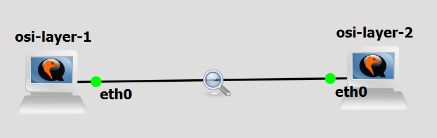

# 
Bu bölüm 42'nin BADASS projesinin kapsamı dışında kalmaktadır. Bulunduğumuz dizinin oluşturulmasının nedeni BADASS projesinde internet paketleri oluşturup, çalışma mantıklarının daha iyi kavranabilmesini sağlamak.

	

Python ile OSI üzerindeki layer 2, layer 3 ve layer 4 katmanlarını ele alıyoruz. İlgili Dockerfile dosyasını build ettikten sonra python scriplerini taşınıyor ve internet altyapısını yönetmemizi sağlayacak toolların bulunduğu container ortamımızı sağlanmış oluyor. Her scrip içerisinde belli başlı açıklamalar yer alıyor bu bölümde örneklemleri artırıp her şeyi anlatmaktansa bizce en etkili öğrenme yöntemi olan "kurcalama" 'ya sizleri davet ediyoruz.
