## Konu Başlıkları
  - [Router ve Switch cihazlarının birbirlerinden asıl farkları](#router-ve-switch-cihazlarının-birbirlerinden-asıl-farkları)
  - [Ağ teriminin geniş ve bağlama göre değişkenlik gösterebilir (formlanabilir) cinste bir kavram oluşu üzerine](#ağ-teriminin-geniş-ve-bağlama-göre-değişkenlik-gösterebilir-formlanabilir-cinste-bir-kavram-oluşu-üzerine)
  - [VLAN nedir?](#vlan-nedir)
  - [Layer 3 cihazları ile mantıksal olarak ağ segmenlendirilmesine rağmen neden Layer 2 katmanında bu sorun çözülmeye çalışılmıştır?](#layer-3-cihazları-ile-mantıksal-olarak-ağ-segmenlendirilmesine-rağmen-neden-layer-2-katmanında-bu-sorun-çözülmeye-çalışılmıştır)
  - [VLAN egzersizi](#vlan-egzersizi)
  - [Gerçek senaryo da VLAN ağ dilimlemesi teknik olarak nerede ve nasıl yapıyor? Ayrım tam olarak nerede yapılıyor konfigüre ediliyor?](#gerçek-senaryo-da-vlan-ağ-dilimlemesi-teknik-olarak-nerede-ve-nasıl-yapıyor-ayrım-tam-olarak-nerede-yapılıyor-konfigüre-ediliyor)
  - [VLAN'ın teknik sınırları ve yetersizliği](#vlanın-teknik-sınırları-ve-yetersizliği)
  - [VXLAN nedir?](#vxlan-nedir)
  - [VLAN ile VXLAN'ın konfigürasyonel farklılıkları](#vlan-ile-vxlanın-konfigürasyonel-farklılıkları)
  - [VXLAN'ın İşleyişi](#vxlanın-i̇şleyişi)
  - [Uç cihazlar Layer 3 katmanında çalışan cihazlar ise nasıl Layer 2 paketi gönderebiliyorlar?](#uç-cihazlar-layer-3-katmanında-çalışan-cihazlar-ise-nasıl-layer-2-paketi-gönderebiliyorlar)
  - [Statik mod ile temel ve basit bir VXLAN topoloji örneği](#statik-mod-ile-temel-ve-basit-bir-vxlan-topoloji-örneği)
  - [Unicast, Multicast, Broadcast nedir?](#unicast-multicast-broadcast-nedir)
  - [Unicast, Multicast ve Broadcast bunlar cihaz tarafından arkaplanda otomatik olarak gerceklestirilen mekanikler. Örneğin bir cihazin unicast veya multicast olarak davranması gerektiği nasıl belirtiliyor?](#unicast-multicast-ve-broadcast-bunlar-cihaz-tarafından-arkaplanda-otomatik-olarak-gerceklestirilen-mekanikler-örneğin-bir-cihazin-unicast-veya-multicast-olarak-davranması-gerektiği-nasıl-belirtiliyor)
  - [`224.x.x.x` ile `239.x.x.x` arası multicasting yapabilmek için özel olarak ayrılmış IP adresleri](#224xxx-ile-239xxx-arası-multicasting-yapabilmek-için-özel-olarak-ayrılmış-ip-adresleri)
  - [Broadcast ve ARP ilişkisi nedir? Bir cihaz ne zaman ARP atar? ARP her zaman mı atılır yoksa gerektiğinde mi? Gerektiği zaman ne zaman?](#broadcast-ve-arp-ilişkisi-nedir-bir-cihaz-ne-zaman-arp-atar-arp-her-zaman-mı-atılır-yoksa-gerektiğinde-mi-gerektiği-zaman-ne-zaman)
  - [Unicast, Multicast, Broadcast vb. mekaniklerin pratik olarak denenebilirliği için uygun protokolü kullanan bir aracın gerekliliği üzerine](#unicast-multicast-broadcast-vb-mekaniklerin-pratik-olarak-denenebilirliği-için-uygun-protokolü-kullanan-bir-aracın-gerekliliği-üzerine)
  - [Multicast modu ile temel ve basit bir VXLAN topoloji örneği](#multicast-modu-ile-temel-ve-basit-bir-vxlan-topoloji-örneği)
  - [Bir ağ interface'inin detaylarını daha da fazla görme komutu](#bir-ağ-interfaceinin-detaylarını-daha-da-fazla-görme-komutu)
  - [Sanal ağ arayüzlerinin paket iletimi üzerine](#sanal-ağ-arayüzlerinin-paket-iletimi-üzerine)
  - [Bir ağ arayüzüne (eth0, eth1 vb.) birden fazla IP adresi nasıl atanabiliyor? Ve durum böyle ise o halde bir cihazın birden fazla port'unun olmasının ne anlamı ve gereği var?](#bir-ağ-arayüzüne-eth0-eth1-vb-birden-fazla-ip-adresi-nasıl-atanabiliyor-ve-durum-böyle-ise-o-halde-bir-cihazın-birden-fazla-portunun-olmasının-ne-anlamı-ve-gereği-var)
  - [Bridge ağ arayüzüne bağlı port'ların incelenmesi](#bridge-ağ-arayüzüne-bağlı-portların-incelenmesi)
  - [VXLAN'ın statik modda (unicast) veya dinamik multicast modda ayarlanması sonucunda bu modların farklari ve üstlendikleri roller](#vxlanın-statik-modda-unicast-veya-dinamik-multicast-modda-ayarlanması-sonucunda-bu-modların-farklari-ve-üstlendikleri-roller)
  - [Uç cihazdan gönderilen bir paketin VXLAN yapılı ağda ki yolculuğu](#uç-cihazdan-gönderilen-bir-paketin-vxlan-yapılı-ağda-ki-yolculuğu)

## Part 2

### Router ve Switch cihazlarının birbirlerinden asıl farkları
OSI modeli (ağ iletişimini katmanlara bölen model) bazında **Router Layer 3** katmanında çalışır ancak **Switch Layer 2** katmanında çalışır.

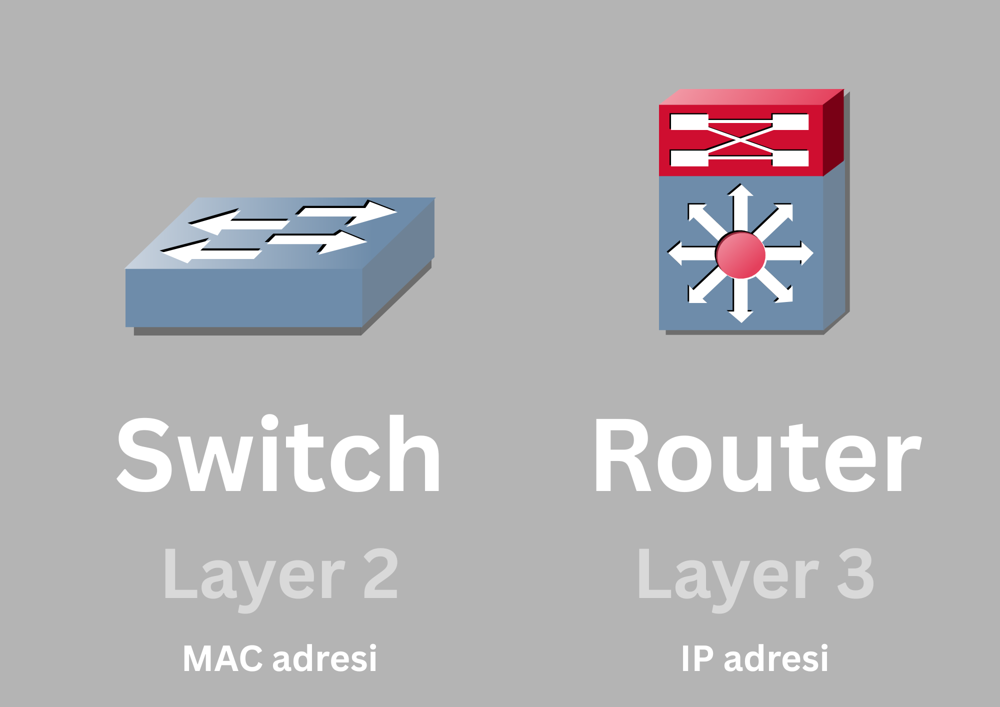

Switch subnet'leri anlamaz. Switch sadece MAC adresi ile (layer 2'de) çalışır — _"bu MAC adresi bu porta bağlı"_ diyor ve paketi oraya gönderiyor. IP adresine, subnet'e bakmıyor. Kısaca Switch'e bağlı cihazları mantıksal olarak subnetlere bölsek de Switch tamamen farklı şekilde çalıştığından (MAC adresine göre) bu yapılandırmadan bir haber şekilde ona gelen paketlerin kime iletileceğini kendi ağında mevcut mu (yani bu cihazlar bu Switch'e bağlımı) diye bakarak paketleri doğru makinelere yönlendirebilir. 

Teorik açıdan bakıldığında sanki switch'e bağlı tüm cihazlar birbirlerine `ping` atabilir iması oluşuyor olabilir. Ancak bu tamamen yanlış bir ima ve zan olacaktır. Çünkü Switch IP ile değil, MAC adresi ile çalışıyor olsada hostlar IP katmanında (Layer3 seviyesinde) karar verir; aynı subnet içinde olan cihazlar arasındaki paket transferi davranışı ile farklı subnette bulunan bir cihaza erişilmek istenildiğindeki davranışı bir değildir. Hostun davranış diyagramı aşağıdaki gibidir:

- Aynı subnet: ARP atılır → MAC öğrenilir → switch iletir
- Farklı subnet: ARP atılmaz bile, gateway aranır -> o da olmadığı için paket host'dan dışarı dahi çıkamaz.
- Farklı subnet (default gateway'li): ARP atılmak istenir -> gateway aranır -> ARP atılır -> hosta iletilir -> host farklı subnette olmasından dolayı MAC adresini cihazın MAC adresi yerine gateway'in MAC adresini olarak yazar -> switch içerisinde paket ölür.

Peki switch'ler neden sadece MAC adreslerine bakıp cihazlar arası iletişimi sağliyor diye bir soru sorulursa bu tamamen bu cihazin bu sekilde çalışılması istendiğinden dolayı bu şekilde tasarlanmış olduğu şeklinde cevap verilebilir :d

<p align="center">
  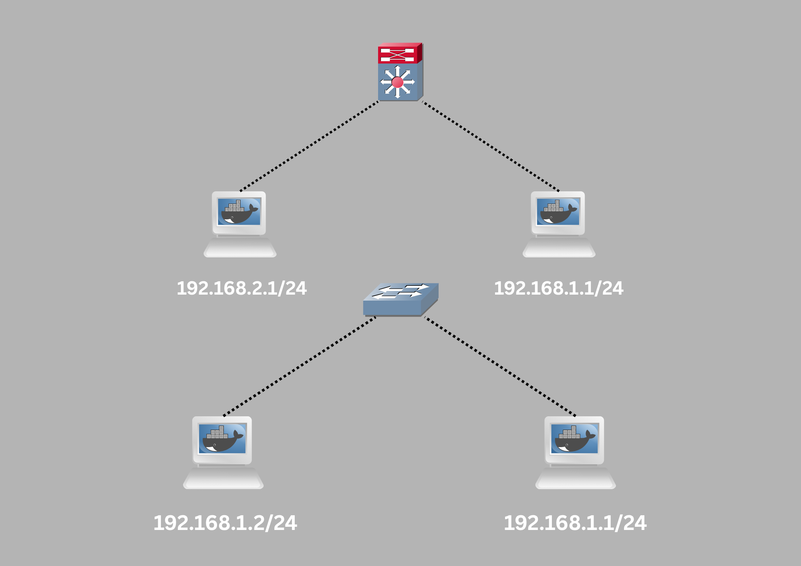
</p>

Switch → Aynı ağdaki cihazları birbirine bağlar. "Sen ve ben aynı ağdayız, direkt konuşabiliriz." (`192.168.1.0/24` ağında ki tüm cihazlar switch'i kullanarak birbirleriyle iletişim kurabilir)

Router → Farklı ağlar arasında köprü kurar. "Sen farklı ağdasın, sana ulaşmak için yönlendirme gerekiyor." (192.168.1.1/24 ile 192.168.2.1/24 farklı ağlarını birbirine bağlar)


### Ağ teriminin geniş ve bağlama göre değişkenlik gösterebilir (formlanabilir) cinste bir kavram oluşu üzerine

Ağ kavramı çok geniş ve bağlama göre değişkenlik gösterebilir cinsten bir terim olduğundan şunlar belirtilmeli;

<p align="center">
  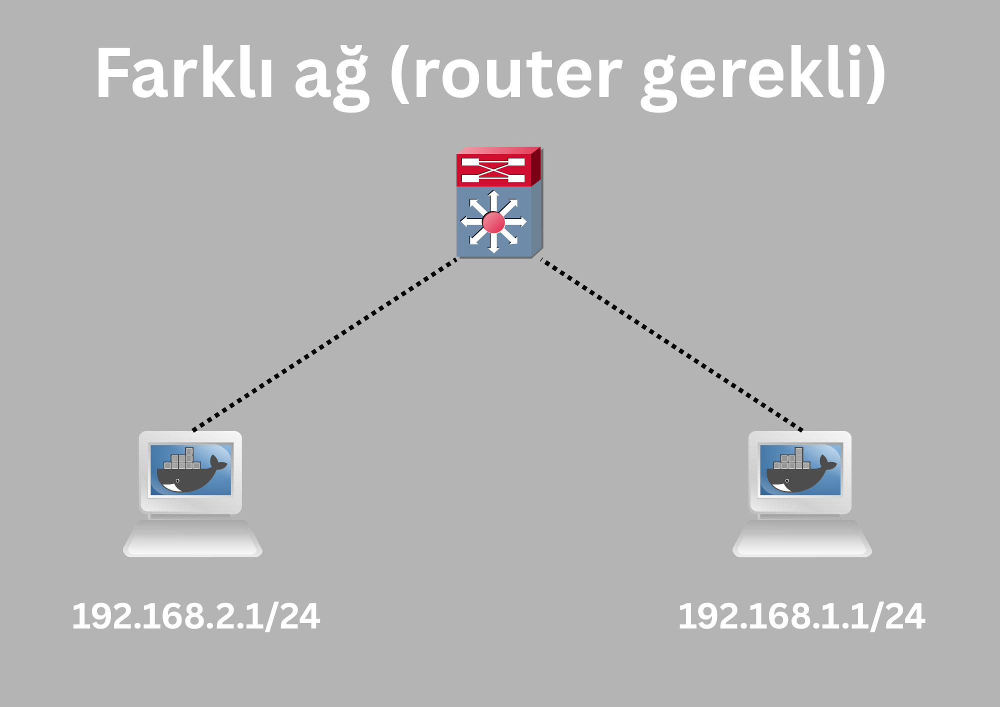
  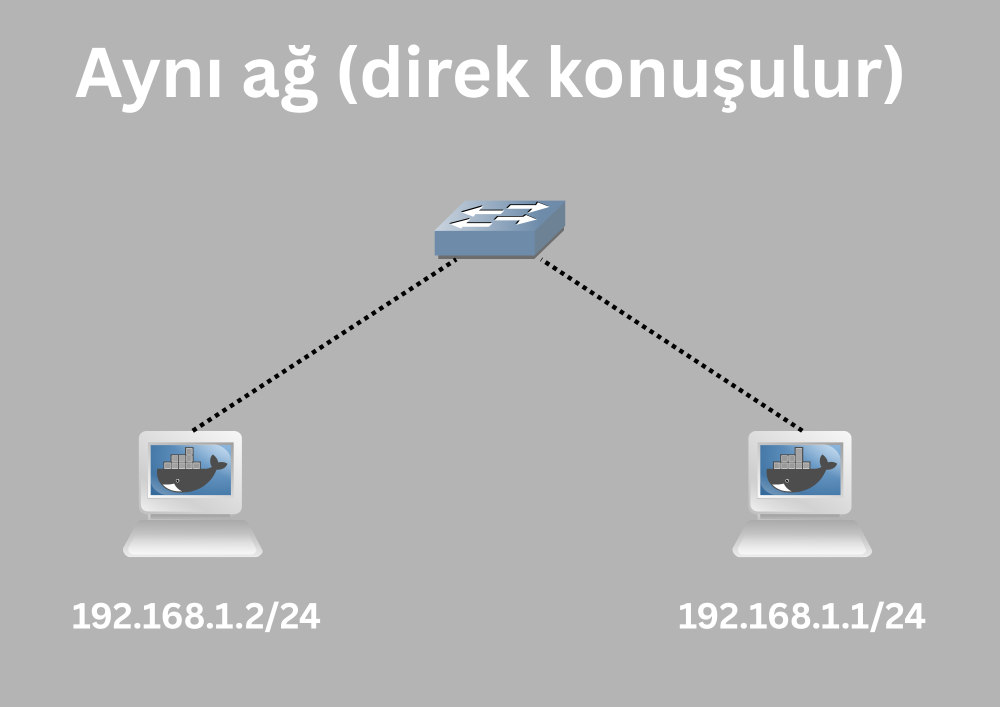
</p>


**Aynı ağ = aynı subnet** demek. Yani `192.168.1.0/24` subnet'indeki tüm cihazlar _"aynı ağda"._ Bu cihazlar birbirleriyle direkt konuşabiliyor — router'a gerek yok, switch yeterli.

**Farklı ağ = farklı subnet** demek. `192.168.1.0/24` ile `192.168.2.0/24` farklı ağlar. Bu iki ağ arasında iletişim için router gerekiyor — switch tek başına yetmiyor.


### VLAN nedir?


VLAN, VXLAN vb. terimlerin/çözümlerin/yöntemlerin/tekniklerin neye istinaden geliştirildiğini/ortaya çıkarıldığını anlayabilmek için önce bu tip çözümlemelerin ortaya çıkmadan önce ki meydanda olan mevcut halin/sorunların anlaşılması gerekli. Böylece bu çözümler öğrenilmek istenen konu kapsamında daha iyi kavranacaktır. Konuyu doğrudan ortaya çıkmış bir çözüm üzerinden anlamaya çabalamak kafa da çok fazla boşluğun kalmasına sebebiyet verebilir. Örneğin bir ağ mevcut (tüm uç cihazların bir switch'e bağlı olduğu bir topoloji) ve bu ağ segmentlendirilmek/bölümlendirilmek isteniyor. Çünkü aynı ağ içerisinde ki bazı uç cihazların bir diğer başka uç cihazlar ile iletişim kurmasına gerek olunmadığına karar verildi. Veya güvenlik için bölümlendirme yapılmak istendi. Veya tamamen keyfi şekilde bölümlendirilme yapılmak istendiğinden bu yapılmak isteniyor. Ağın bazı cihazları muhasebe bazı cihazları IT bölümünde/segment'inde olacak şekilde dilimlenmesi gerek. Ancak switch'in malum niteliği sebebiyle (iletim için tek bir broadcast domain olması) birbirlerinden izole bölümlendirilme yapılamıyor. Bunun için Layer 2 katmanında yani switch gibi cihazların anlayabileceği VLAN adlı bir çözüm devreye sokulabilir oluyor. Switch'e _"bu portlar Muhasebe VLAN'ı, şu portlar IT VLAN'ı, birbirlerini göremezler"_ diyebiliyorsun. VLAN switch'e Layer 3 farkındalığı kazandırmadan mantıksal segmentleme özelliği kazandırıyor. VLAN'ın getirdiği çözüm şu; normal de switch'e bağlı cihazlar tek bir broadcast domain üzerinden birbirleriyle haberleşiyor ancak yukarıda ki örnekte de belirtildiği üzere muhasebe ve IT departmanları birbirleriyle hiçbir zaman iletişim kurmayacaksa (veya genellikle) o halde bu broadcast domain'i her iletim esnasında meşgul etmenin bir yararı yok (çünkü örneğin muhasebe departmanında ARP request atıldığında gereksiz yere IT departmanında ki cihazada bu paket gidecek). Bunun yerine birden fazla broadcast domain'i olsun her biri kendi segment'i ile ilgilensin/yayın yapsın. VLAN, Layer 2 seviyesinde ağı mantıksal olarak bölerek ayrı broadcast domain’ler oluşturur. VLAN şu problemleri çözer:

-  Broadcast trafiğini azaltır:
Tek ağ → herkes ARP alır
VLAN → sadece kendi grubunu görür

-  Güvenlik sağlar
Aynı switch üzerinde izolasyon
Örn:
Muhasebe VLAN 10
IT VLAN 20

- Fiziksel değil mantıksal ayrım
Aynı kablo, aynı switch
Ama sanki ayrı network gibi davranır

VLAN, fiziksel olarak aynı switch üzerinde bulunan cihazları, Layer 2 seviyesinde ayrı ağlar (broadcast domain’ler) haline getirir. Bu ağlar genellikle farklı IP subnet’leri ile eşleştirilir ama bu zorunlu değildir.

| VLAN    | Subnet             |
| ------- | ------------------ |
| VLAN 10 | 192.168.1.0/24     |
| VLAN 20 | **192.168.1.0/24** |

Yani Aynı IP bloğu Ama farklı VLAN →  iletişim yok Neden? Broadcast domain ayrı ve ARP birbirine ulaşamaz veya;

| VLAN    | Subnet             |
| ------- | ------------------ |
| VLAN 10 | 192.168.1.0/24     |
| VLAN 20 | **192.168.2.0/24** |

Her VLAN = ayrı subnet. Aralarında iletişim için router gerekir. İki dizayn/tasarım da çalışır.

### Layer 3 cihazları ile mantıksal olarak ağ segmenlendirilmesine rağmen neden Layer 2 katmanında bu sorun çözülmeye çalışılmıştır?
Küçük topolojilerde VLAN kullanmadan izolasyon ve segmentleme yapılmak isteniyorsa Layer 3 katmanında çalışan cihazlar kullanılabilir. Bu bir tasarım mevzusudur. İstenirse küçük topolojilerde VLAN'da kullanılabilir ancak sorun büyük topolojilerde ortaya çıkıyor. Örneğin bir veri merkezinde binlerce sunucu var. Her sunucu arası iletişim için router kullansaydık ne olurdu? Router her paketi işlemek zorunda. Çok yavaş ve pahalı olurdu (geçmişte router'lar pahalıydı). Ağ trafiği sürekli Layer 3’e çıkıp geri inerdi. Bu ciddi bir performans kaybı. Switch’ler ise donanımsal (ASIC) çalışır çok daha hızlı frame iletir. Ayrıca ucuz. Büyük hacimli trafiği kolayca taşıyor. Bu yüzden aynı ağ içindeki iletişim için switch, farklı ağlar arası için router kullanılıyor. VLAN ile aynı fiziksel switch üzerinde, donanım hızında birden fazla mantıksal ağ oluşturabiliyorsun. amaç segmentasyonu Layer 3’e bırakmadan, Layer 2 seviyesinde daha hızlı ve esnek yapmak. VLAN’ın getirdiği kritik avantaj sayesinde switch kendi içinde: VLAN 10 → ayrı ağ, VLAN 20 → ayrı ağ segmentasyonu yapar. Trafik switch içinde kalır (wire speed). Router sadece gerektiğinde devreye girer. Bu da Router’a aşırı yük gereksiz **hop** yaptırmaz. Ölçeklenebilirlik problemi oluşturmaz. Ayrıca bu aslında _“ya VLAN ya router”_ mevzusu da değil. Bir ağ topolojisinde de zaten switch ve router birlikte de kullanılabilir: 

Router / Layer 3 switch → VLAN’lar arası iletişim:

<p align="center">
  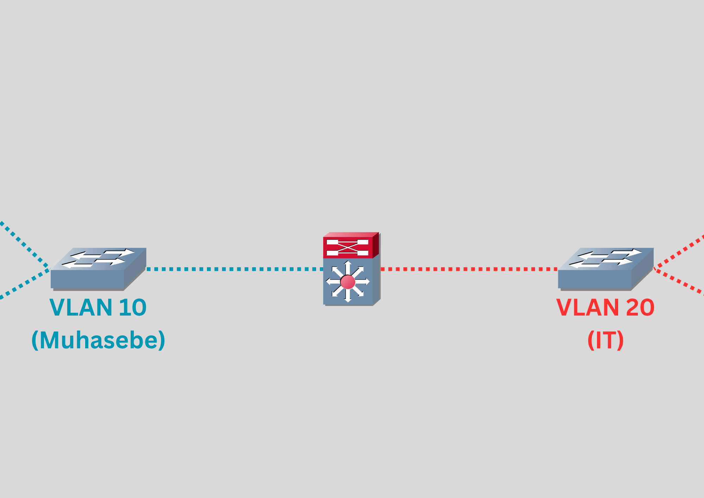
</p>

Buna **Inter-VLAN Routing** denir. 

Eğer VLAN yoksa tüm cihazlar aynı broadcast domain'i kullanır bu da paket iletiminin gerçekleştirilmesi için aynı ağda ki tüm cihazları etkilediğinden ağı yorar. Yükü hafifletmek için ayrım yapılması gereklidir bu da ya fiziksel olarak ayırmak anlamına gelir (maliyetli, aşırı teçhizat) ya da tüm trafiği router’a zorlamak anlamına gelir (pahalı ve performans kaybı). Ancak VLAN ile farklı VLAN bölümleri oluşturulur bu da her bir VLAN bölümüne özgü brodcast domain anlamına gelir ve böylece bir iletim durumunda iletim, yalnızca kendisini ilgilendiren VLAN alanına sorgu/yayın/iletim yapar.

### VLAN egzersizi

<p align="center">
  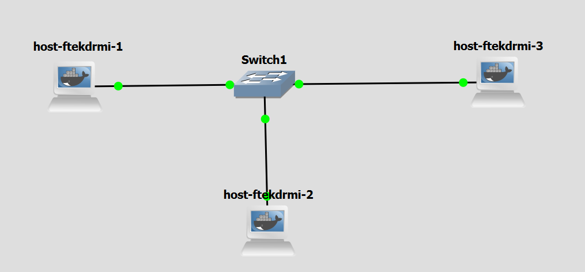
</p>

Cihazlarin IP'leri atanmış ve birbirlerine `ping` atilabilir şekilde ayarlanmış olan bu topolojiyi kurun. GNS3'te _"ethernet switch"_ cihazina çift tıklanıldığında _"Ports"_ bölümü var. Bu bölüm switch cihazinda ki port'lara özgü yapılandırmaların yapılabileceği bir liste ekranıdır. `host-1`'i `port 0`'a, `host-2`'yi `port 1`'e ve `host-3`'ü de `port-2`'ye bağladığımızı düşünelim. Bu örnekte `host-1` ile `host-2`'yi `VLAN 1`'e `host-3`'u de `VLAN 2`'ye ayarlayacağımızı düşünelim. Amaç `host-3`'ün diğer cihazlara `ping` atamamasını sağlamak yani diğer cihazlardan izole etmektir. _"Ports"_ bölümünde `host-3`'e bağlı olan port'a çift tıklayin. _"Settings"_ bölümünde bunun ile ilgili ayarlar gözükecektir. `host-3` `VLAN 1`'de olduğundan _"VLAN"_'ı ayarlama kısmından bunu `2` olarak değiştirin ve _"Add"_ deyin. Ardından bu ayarları uygulayın. `host-1`'den veya `host-2`'den `host-3`'e `ping` atmaya çalışıldığında bu cihazlar aynı subnet'de olmasina rağmen paketlerin gitmediği gözlemlenebilir olacaktır. Ayrıca `host-1/2`'in terminalinden `arp -n` komutu ile ARP tablosunda `host-3`'ün MAC adresinin görüntülenemediği gözlemlenebilir yani VLAN'ın başarıyla uygulandığı bu şekilde doğrulanabilir. Veya `host-3` ile Switch arası bağlantı Wireshark ile incelenecek olursa ve `host-1` veya `host-2`'ye `ping` atılacak olursa bunun iletilemediği gözlemlenebilir.

### Gerçek senaryo da VLAN ağ dilimlemesi teknik olarak nerede ve nasıl yapıyor? Ayrım tam olarak nerede yapılıyor konfigüre ediliyor?

VLAN ile ağ izolasyonu ve bölümlendirilmesi, ilgili cihaz da yani **switch'te** yapılır. Switch, port'larına bağlı cihazları VLAN tekniği sayesinde ayırabilir. Bunun için switch'in terminal arayüzüne erişilmesi gereklidir. Bu da klasik olarak (tıpkı bir ev router'ını konfigüre eder gibi) bir PC'yi switch'e kablo ile bağlayıp PC terminalinden switch'in terminal arayüzüne erişilerek yapılır. Erişim yapıldıktan sonra orada bulunan araçlar ile switch üzerinde ki port'lara VLAN ID tag'lemesi (etiketlemesi VLAN 10, VLAN 20 vb. gibi) yapılır. Böylece switch yapılan konfigürasyona göre hangi portunun VLAN ID etiketlemesi yapıldığını bilir. Yani o port'a bağlı olan cihaz VLAN 10’dadır **değil**, bu switch portu VLAN 10’dadır (yani bu port'a bağlı olan cihaz dolaylı olarak VLAN 10'da olmuş oluyor). İzolasyonun veya ayrımın bilgisi yalnızca switch tarafından bilinir yani sadece kendi kendine bu ayrım bilgisine sahiptir. Ağın paket iletimi ve kontrollerinin hepsi onun üzerinden geçtiğinden yapılan konfigürasyona göre kendince ağ dilimlendirmesi ve izolasyon yönetimini böyle yapabilir.

```
PC-1 ─ Port 1 ┐
PC-2 ─ Port 2 ┤ ── Switch
PC-3 ─ Port 3 ┘
```

Switch’e diyorsun ki:

```
Port 1 → VLAN 10
Port 2 → VLAN 10
Port 3 → VLAN 20
```

Sonuç olarak;

```
PC1 ve PC2 → aynı VLAN’da
PC3 → farklı VLAN’da
```

Switch aslında şunu yapıyor;

MAC + Port + VLAN tablosu;

```
MAC A → Port 1 → VLAN 10
MAC B → Port 2 → VLAN 10
MAC C → Port 3 → VLAN 20
```

Bu şekilde switch izolasyonu şu kuralı uygulayarak mümkun kılar; _“Aynı VLAN içindeki portlar birbirini görür, farklı VLAN’lar görmez”_;

```
Port 1 (VLAN 10) → Port 2’ye gönderilebilir
Port 1 (VLAN 10) → Port 3’e gönderilemez
```

Switch bunu nasıl biliyor? Switch’in içinde **VLAN database + forwarding logic** vardır yani;

1. Paket gelir
2. VLAN tag veya port bilgisi okunur
3. Lookup yapılır
4. Sadece o VLAN içinde forward edilir

Switch kendisine bağlı olan cihazdan bir paket aldiginda o port'un VLAN ID'si zaten ayarlı ve konfigüreli oldugundan paketi tag'leyebilir (etiketler). Etiketliyebilir olmasının sebebi ağın yapısına göre değiştiğinden switch'in davranışını da değiştirebilir bu yüzden bununla ilgili iki yöntem vardır;

1. Access port (Host-1’e bağlı)
- VLAN tag YOK
- Switch içeride ekler/siler

<p align="center">
  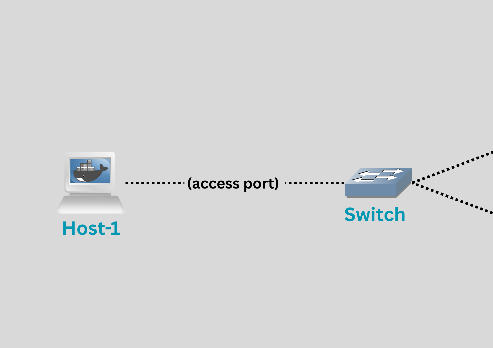
</p>

Host-1, VLAN'ı bilemeyeceğinden (IP Layer 3 katmanında çalıştığından) switch'e sadece normal Ethernet frame gönderir;

```
| MAC | MAC | Data | -> gibiş
```

 Paket Switch’e gelince switch şunu yapar. Paketin hangi porttan geldiğini bilir ve o port _“VLAN 10 access port”_ diye ayarlıdır paketi VLAN 10’a ait kabul eder eğer paket switch’ten çıkacaksa başka switch’e giderken tag eklenebilir. Özetle VLAN bilgisi çoğu zaman porttan türetilir.

2. Trunk port (switch-switch arası)
- VLAN tag VAR
- Switch tag’i korur

<p align="center">
  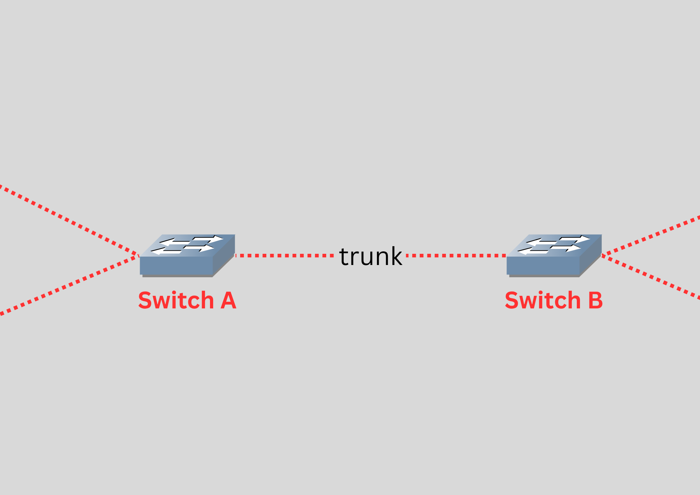
</p>

Burada ise VLAN tag taşınır - switch tag eklemez veya silmez (çoğu durumda). Yani _Switch A_ tag eklemiş olabilir. _Switch B_ aynen kabul eder.

VLAN pakete ne yapar? Normal bir Ethernet frame:

<p align="center">
  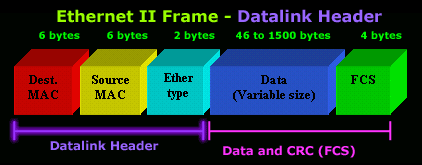
</p>

VLAN eklenince araya küçük bir etiket girer:

<p align="center">
  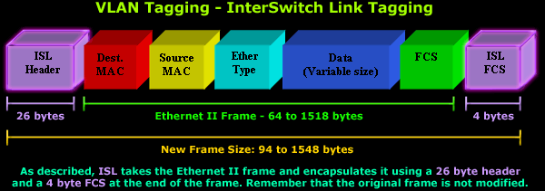
</p>

Bu etiket VLAN ID (örneğin 10, 20). Bu yapının sebebi: IEEE 802.1Q ile ilgilidir. Özetle VLAN bir _“paket özelliği”_ değil switch’in pakete eklediği “etiket”'dir.

### VLAN'ın teknik sınırları ve yetersizliği
VLAN ile bir subnet'i dilimlendirmek belirli bir sayıya kadar gerçekleştirilebilir. VLAN ID'si **12 bit** ile temsil ediliyor yani `2¹² = 4096`, bunun 2'si özel ayrılmış, geriye **4094** kullanılabilir ID kalıyor. Bu teknik bir sınırdır. VLAN standardı (802.1Q) tasarlanırken 4094'ün yeterli olacağı düşünülmüş. ancak internet ve bulut bilişim beklenenin üzerinde büyüyünce bu sayı yetersiz kalmıştır. Yani bir veri merkezinde VLAN tekniği ile ağ bölümlendirmesi yapmak mümkündür ancak daha fazlası gerektiğinde bu gerçekleştirilemiyor. Bunun çözümü içinse VXLAN geliştirilmiştir. Ayrıca bu yeni teknik ile sadece daha fazla sanal ağ ID'si arttırmakla kalmamış aynı zaman da farklı çözümleri de beraberinde getirmiştir.

Bu tekniğin veri merkezlerinde kullanılacağı düşünülürse ve mevcut ağın dilimlenip neden izolasyon yapılmak istendiği üzerine düşünülürse ve buna müteakip çok kabaca bir örnek verilecek olursa; bir cloud sağlayıcısı düşünelim ve basit yapılı bir ağ'ın içinde tek bir VLAN uygulanmış olsun. Bu sağlayıcı, ağına içinde tek bir VLAN uyguladığı icin 4096 adet müşteriye kendi ağ altyapısı üzerinde VPC hizmeti verebilir (her müşterinin yalnızca tek bir VPC hizmetinden yararlanacağı düşünülürse). Ancak bir fazlasını yani 4097. müşteriye VPC yani kendi altyapısı üzerinde özel ağ kurma hizmeti sağlayamazdı. İşte bu soruna çözüm olarak VXLAN ortaya çıkmış ve ağı **2 üzeri 24 adet yani 16.7 milyon** dilime bölümlendirebilir hale getirmiştir. Bu da yine konunun anlaşılması açısından kabaca ifade edilecek olursa 16.7 milyon tane müşteri demektir. Tabii gerçek senaryolarda bir müşteri istediği kadar da VPC hizmeti kullanabilir ve cloud sağlayıcıları merkezlerini donanımsal açıdan daha fazla geliştirip daha fazla VXLAN yapılı ağlar kurup daha fazla ağ dilimlemesi elde edebilirler ki gerçek dünyada da sistem zaten kabaca bu şekilde işliyor.

### VXLAN nedir?

<p align="center">
  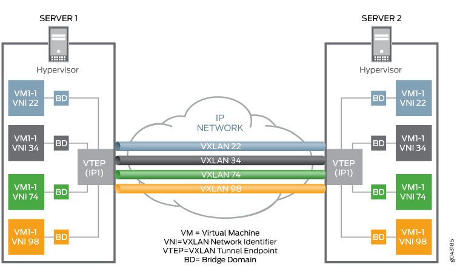
</p>

VLAN'in sanal ağ ID sayısı tasarımı gereği büyük veri merkezleri gibi yerlerde yetersiz kalmasından ötürü bunun üstüne geliştirilen VXLAN yalnızca sanal ağ ID sayı aralığını fazlalaştırmak ile kalmamış aynı zaman da farklı fiziksel lokasyonlarda bulunan ağları sanki aynı switch'e bağlılarmış gibi zannettirme davranışını da sergilemesi sağlanmıştır. Yani İstanbul'daki sunucu ile Ankara'daki sunucu aralarında internet olmasına rağmen sanki aynı switch'e bağlıymış gibi davranabilir. Buna **Overlay network** deniyor mevcut ağın üzerine sanal bir Layer 2 ağı örüyorsun (tünelleme).

<p align="center">
  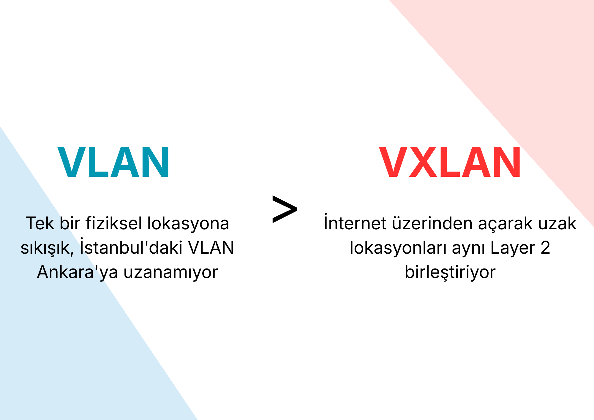
</p>

| Özellik | VLAN          | VXLAN              |
| ------- | ------------- | ------------------ |
| Değişim | Tag ekler     | Paket kapsüller    |
| Katman  | Layer 2       | Layer 3 üstü       |
| Kapsam  | Local network | Datacenter/Cloud   |
| Cihaz   | Switch        | VTEP (host/router) |
| Amaç    | Ayrım         | Taşıma + ölçek     |

### VLAN ile VXLAN'ın konfigürasyonel farklılıkları

VLAN'ı ağ da uygulamak için switch üzerinde bir konfigürasyon yapılıyordu. Bunun sebebi bütün ağın paket iletimi switch cihazı üzerinden sağlanmasından ötürü ağ izolasyonu/dilimlemesi/bölümlendirmesi bu cihazın terminal arayüzünden veya varsa grafik arayüzüne erişilip gerekli ayarın ayarlanmasıyla mümkün kılınıyordu (port bazlı bir ayar). Ancak VXLAN farklı, switch üzerinde değil, **VTEP** cihazları üzerinde yapılıyor. VXLAN'da konfigürasyon VTEP uygulanabilir bir cihaz üzerinden sağlanıyor. _"VTEP = VXLAN Tunnel Endpoint"_ tüneli açan ve kapatan cihaz. Yani proje de FRR yüklü olan custom docker router'larımız VTEP cihazı olarak ayarlanabiliyor/formlandırılabiliyor.

VTEP şunu yapıyor:

<p align="center">
  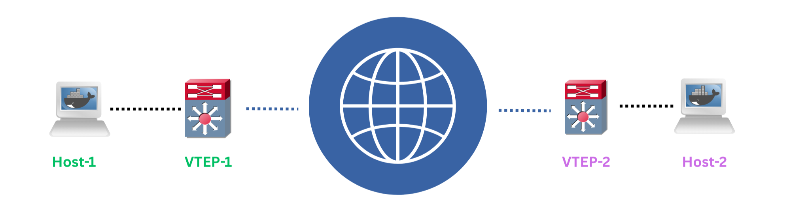
</p>

```
Host-1'den paket geliyor (end device)
        ↓
VTEP-1 paketi alıyor (FRR router)
        ↓
Üzerine VXLAN başlığı ekliyor (encapsulation)
        ↓
Normal IP paketi gibi internetten gönderiyor
        ↓
VTEP-2 paketi alıyor (other FRR router)
        ↓
VXLAN başlığını soyuyor (decapsulation)
        ↓
Host-2'ye iletiyor (other end device)
```

### VXLAN'ın İşleyişi
VXLAN'ın yaptığı işlem özetle kendisine gönderilen Layer 2 paketini Layer 3 paketi olarak sarmalamak.

<p align="center">
  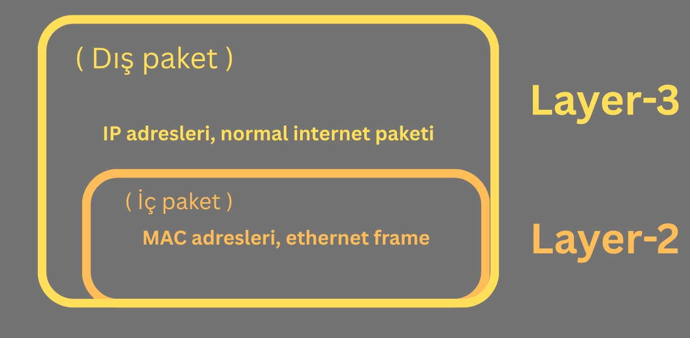
</p>

Yani VTEP cihazı (FRR router'ımız) şunu yapıyor:

- Host-1'den gelen Layer 2 ethernet frame'ini alıyor
- Onu bir UDP paketi içine koyuyor
- Bu UDP paketi normal internet üzerinden gidiyor
- Karşı taraftaki VTEP UDP paketini açıyor
- İçindeki Layer 2 frame'i çıkarıp Host-2'ye iletiyor

Host-1 ve Host-2 hiç farkında değil onlar için sanki aynı switch'e bağlılar. Aradaki tüm Layer 3 işlemi onlardan gizli. Yani VXLAN Layer 2'yi taklit ediyor ancak gerçekte Layer 3 üzerinden taşıyor ama uç cihazlara Layer 2 gibi görünüyor. Daha detaylı olarak düşünecek olursak uç cihazdan gelen paketin Layer 2 frame'ini Layer 3 olarak kılıflandırıyor;

<p align="center">
  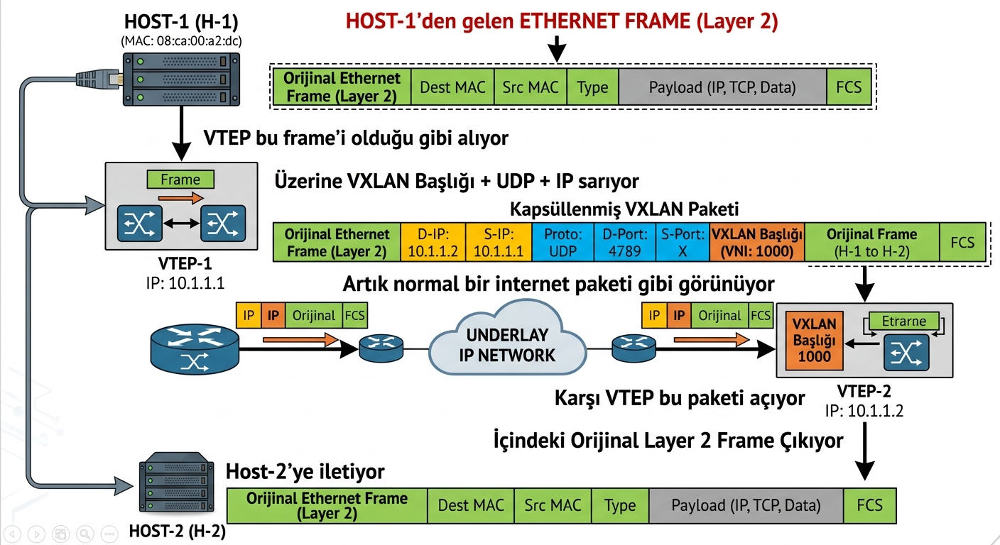
</p>

```
Host-1'den gelen ethernet frame (Layer 2)
        ↓
VTEP bu frame'i olduğu gibi alıyor
        ↓
Üzerine VXLAN başlığı + UDP + IP sarıyor
        ↓
Artık normal bir internet paketi gibi görünüyor
        ↓
Karşı VTEP bu paketi açıyor
        ↓
İçindeki orijinal Layer 2 frame çıkıyor
        ↓
Host-2'ye iletiyor
```

### Uç cihazlar Layer 3 katmanında çalışan cihazlar ise nasıl Layer 2 paketi gönderebiliyorlar?
Bir web sitesine istek atıldığında bilgisayar ne gönderiyor? Sadece IP paketi mi? Hayır. Her cihaz bilgisayar, telefon, sunucu ağa bir şey gönderirken her zaman hem Layer 2 hem Layer 3 kullanıyor. Katmanlar iç içe:

<p align="center">
  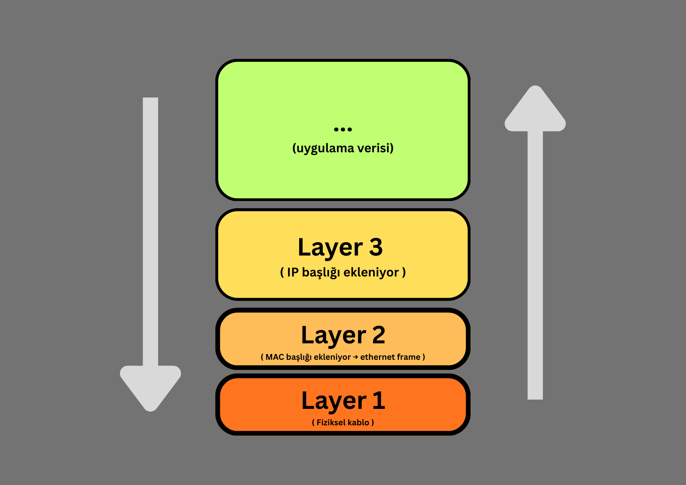
</p>

Yani her cihaz veriyi göndermeden önce katman katman sarıyor. Karşı taraf da katman katman açıyor. _"Layer 3 cihazı"_ veya _"Layer 2 cihazı"_ derken aslında o cihazın hangi katmana kadar baktığını kastediyoruz:

```
Switch → Layer 2'ye kadar bakıyor, MAC adresine göre yönlendiriyor
Router → Layer 3'e kadar bakıyor, IP adresine göre yönlendiriyor
Host → tüm katmanları kullanıyor
```

Yani host cihazlar da Layer 2 paketi gönderiyor. Her zaman. VXLAN VTEP bu Layer 2 paketini yakalayıp kılıf olarak kullanacağı Layer 3 paketinin içine koyuyor.

### Statik mod ile temel ve basit bir VXLAN topoloji örneği

<p align="center">
  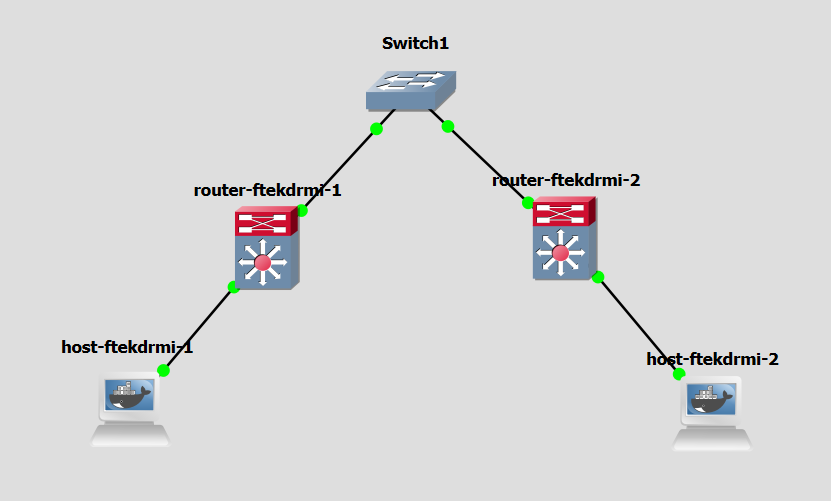
</p>

**Router-1** ve **Router-2** VTEP görevi yapacak. İlk olarak statik mod ile başlayacağız yani VTEP'lerin birbirinin IP'sini elle gireceğiz.

Topoloji IP planı:
```
host-ftekdrmi-1 tarafı → 192.168.1.0/24
Router'lar arası → 10.0.0.0/30
host-ftekdrmi-2 tarafı → 192.168.2.0/24
```

---

<p align="center">
  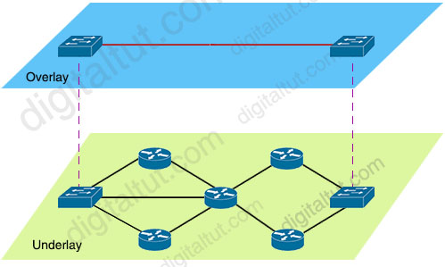
</p>

IP planı uygulandıktan ve `ping` ile iletişimin sağlandığı doğrulandıktan sonra _"Underlay"_ ağın çalıştığıyla/kurulu olduğuyla ilgili hemfikir olunabilir. VXLAN bağlamında bu fiziksel ağa _"Underlay"_ deniyor. Şimdi ise _"Overlay"_ yani VXLAN ile sanal ağ yapılandırılması için VXLAN tünelini kuracağız. Router-1'in terminalinde şu komutu çalıştır:

```sh
ip link add vxlan10 type vxlan id 10 remote 10.0.0.2 local 10.0.0.1 dev eth1
```

Bu komut satırı kısım kısım incelenecek olursa;

- `ip link` -> komutunun genel kullanımı: ağ arayüzlerini yönetmek — oluşturmak, silmek, aktive/deaktive etmek. Daha önce `ip link set eth0 up` ile aktive etmiştik, şimdi ise `ip link add` ile yeni bir sanal arayüz oluşturuyoruz. Kısaca ağ arayüzleri ile ilgili ayarlar yapmayı sağlayan komut aracı.
- `ip link add vxlan10` -> ismi `vxlan10` olacak şekilde yeni bir ağ arayüzü oluşturuyoruz.
- `type vxlan id 10` -> bu ağ arayüzünün tipinin `vxlan` bir sanal ağ olacağını ve id numarasının ise `10` olacağı belirtiliyor.
- `remote 10.0.0.2` -> bu kısım ise karşı VTEP cihazımızın IP adresini belirttiğimiz kısım (statik mod kısmı burası yani manuel olarak karşı VTEP cihazının IP adresini elle girdiğimiz bölüm)
- `local 10.0.0.1` -> bu şuan da ayarı yapılan VTEP cihazının kendi IP adresi. Yani _"ben kimim?"_ sorusunun cevabı. VXLAN paketi gönderirken kaynak IP olarak bu kullanılacak.
- `dev eth1` -> bu tünelin hangi fiziksel arayüz üzerinden çalışacağı. Router-1'in Router-2'ye bağlı arayüzü `eth1`. Tünel trafiği buradan akacak.

Özetle: *"vxlan10 adında bir VXLAN arayüzü oluştur,
VNI ID'si 10 olsun,
karşı VTEP 10.0.0.2'de,
ben 10.0.0.1'im,
eth1 arayüzünü kullan"* demiş olduk


komut çalıştırıldığı taktirde bir uyarı mesajı çıktısı verebilir şunun gibi;

```sh
vxlan: destination port not specified
Will use Linux kernel default (non-standard value)
Use 'dstport 4789' to get the IANA assigned value
Use 'dstport 0' to get default and quiet this message
```

Bu bir hata değil uyarı mesajıdır `ip a` komutu ile ağ arayüzleri listesine bakılacak olursa `vxlan10` isimli sanal ağ arayüzünün oluşturulduğu görülebilir. Bu uyarı ne diyor? _"VXLAN için hangi port numarasını kullanacağımı belirtmedin. Linux'un kendi varsayılan değerini kullanacağım ama bu IANA'nın belirlediği standart değil."_ IANA = Internet Assigned Numbers Authority port numaralarını standartlaştıran kurum. VXLAN için resmi port _**4789**_. Yapmadan olur muydu? Teknik olarak çalışırdı ama iki VTEP cihazı farklı portlar kullanırsa birbirini anlayamaz. _**4789**_ yazarak _"ikimiz de aynı standart portu kullanalım"_ demiş oluyoruz. Ayrıca VXLAN bir protokol ve bu protokol UDP üzerinden çalışıyor. UDP paketleri gönderilirken bir port numarası belirtmek zorunda. Router-2 bir UDP paketi aldığında _"bu paket kime?"_ diye soruyor. Pakette port numarası var ve _"4789 portuna gel"_ diyor. Router-2 _**"4789"**_ portunu dinleyen VXLAN servisine paketi iletiyor. Burada servisten kastedilmek istenen tam olarak şu; Linux arka planda _"4789 portuna gelen UDP paketlerini ben karşılarım"_ diyor. Bu VXLAN'ın kernel içinde ki işleyişi. Eğer port belirtmezsen:

- Router-1 bir port kullanıyor
- Router-2 başka bir port bekliyor
- Paketler eşleşemiyor

Standart port 4789 olduğundan ikisi de aynı portu kullanıyor ve iletişim kuruluyor.
Kısaca VXLAN bir servis değil ama UDP üzerinden çalıştığı için port numarası şart ve 4789 herkesin anlaştığı standart port.

```
80  → HTTP (web)
443 → HTTPS (güvenli web)
22  → SSH
4789 → VXLAN (IANA standardı)
```

gibi düşünülebilir.

komut uygulandiysa şu komut ile ağ arayüzünü silip;
```sh
ip link delete vxlan10
```

port'un `4789` olarak ayarlandığı şekliyle yeniden ağ arayüzünü oluşturun;

```sh
ip link add vxlan10 type vxlan id 10 remote 10.0.0.2 local 10.0.0.1 dstport 4789 dev eth1
```

ardından arayüzü aktive et;

```sh
ip link set vxlan10 up
```

Sonra Router-2'de de aynı işlemi yap ama dikkat, local ve remote IP'leri yer değiştirecek:

```sh
ip link add vxlan10 type vxlan id 10 remote 10.0.0.1 local 10.0.0.2 dstport 4789 dev eth1
ip link set vxlan10 up
```

Şimdi bridge'i kuracağız. Bridge, host'tan (end devices) gelen trafiği VXLAN tüneline aktaran sanal bir switch gibi düşünülebilir. Bridge burada VTEP cihazina bağlı olan end device'ların trafiğini fizikselden (underlay) değilde VXLAN trafiğinden yani tünelinden (overlay) geçirmek için konfigüre edilmesi gereken bir ayardır.

<p align="center">
  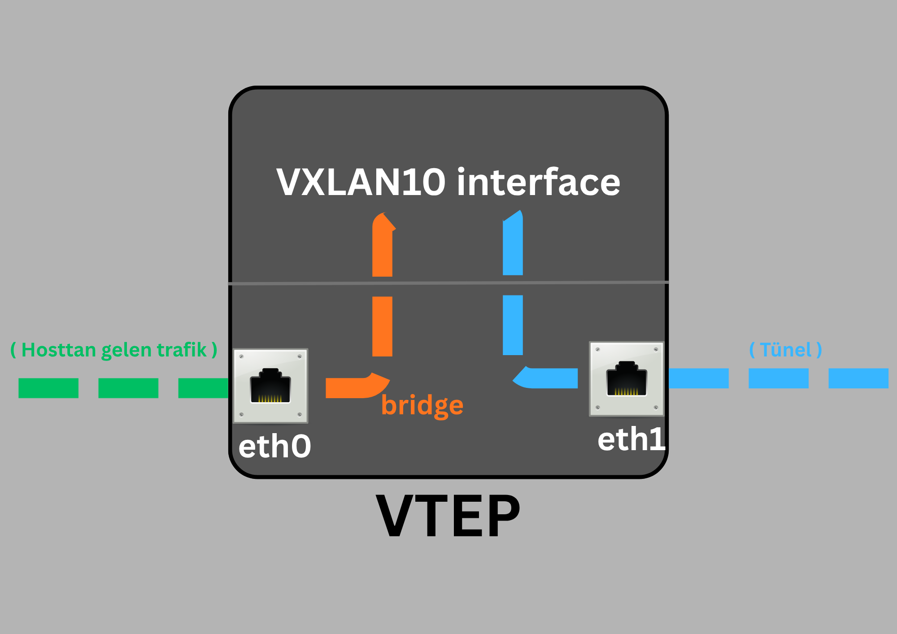
</p>

Bridge, host'un ethernet trafiğini VXLAN tüneliyle buluşturuyor. Yani host normal ethernet paketi gönderiyor, bridge onu VXLAN'a yönlendiriyor. Host'un VXLAN'dan haberi yok. Host tamamen habersiz, sadece normal ethernet paketi gönderiyor. VTEP (router) her şeyi hallediyor. Host'un ilgilendiği tek şey paketin gönderilip gönderilemeyeceğidir. Tabii ki biz arkaplanda paketin gönderilebilmesi için arkaplan ayarları (overlay konfigürasyonları) yaptığımızdan paket gönderilecektir. Bunun mümkün kılanabilmesi için Router-1'de şu komutların uygulanması gerekli;

```sh
ip link add br0 type bridge
ip link set br0 up
ip link set vxlan10 master br0
ip link set eth0 master br0
```

her bir komutu teker teker ele alacak olursak;

- ilk komut `bridge` tipinde ve `br0` isminde bir köprü ağ arayüzü oluşturuyor.
- ikinci komutta bunu aktive ediyoruz.
- `ip link set vxlan10 master br0` --> `vxlan10` arayüzünü `br0` bridge'ine bağla
- `ip link set eth0 master br0` --> `eth0` arayüzünü `br0` bridge'ine bağla

`master` keyword'ü şunu demek: _"bu arayüzün sahibi br0 olsun."_ Yani `br0` bir switch gibi davranıyor ve hem `eth0` hem `vxlan10` onun portları oluyor. Veya bir boru veya köprü gibi düşünülürse bunların iki ucunun nereye bağlanması gerektiğinin belirtiliyor gibi düşünülebilir.

<p align="center">
  
</p>

`br0` ortada duruyor ve ikisini birleştiriyor. Host'tan gelen trafik VXLAN tüneline, tünelden gelen trafik host'a akıyor. Şimdi Router-2'de de aynı komutları çalıştır;

```sh
ip link add br0 type bridge
ip link set br0 up
ip link set vxlan10 master br0
ip link set eth0 master br0
```

bridge yapılandırması da yapıldıktan sonra son olarak her iki cihazın aynı subnet aralağında olması sağlanarak sanki aynı local ağda veya switch'e bağlılarmış zannını vereceğiz bunun için;

Host-1'in `eth0` ağ arayüzüne IP ata:

```sh
ip addr add 30.1.1.1/24 dev eth0
```

Host-2'ye de:

```sh
ip addr add 30.1.1.2/24 dev eth0
```

Kurgumuz her iki cihazda da `eth0` ağ arayüzünde aynı subnet'e sahip cihazların birbirlerine uzak lokasyonlarda dahi olsalar (yani aralarında internet dahi olsa) sanki aynı switch'e veya aynı lokasyondalarmış davranışını zannettirmek veya sergiletmek olduğundan her iki cihazin aynı subnet'de olduğu IP adresleri atanmalıdır. Bu şekilde arkaplanda ki VXLAN mimarisi çalışacaktır. Ve bu IP adresleri atandığı anda artık **"Overlay"** bir network'e sahip olunuyor. Underlay ağımızda zaten `192.168.1.0/24` ve `192.168.2.0/24` subnet'leri var. VXLAN tüneli üzerindeki sanal ağ tamamen ayrı bir ağ farklı bir subnet kullanarak _"bu IP'ler VXLAN üzerinden geliyor"_ diyebiliyoruz. Host-1 `(30.1.1.1)` ve Host-2 `(30.1.1.2)` aynı subnet'de `30.1.1.0/24`. Aralarında router yok, sanki aynı switch'e bağlıymış gibi. VXLAN bunu sağlıyor. Host-1'den Host-2'ye `ping` atarak "Overlay" ağın çalışıp çalışmadığı test edilebilir;

```sh
ping 30.1.1.2
```

Özet olarak;

- Host-1 `192.168.1.0/24` ağında
- Host-2 `192.168.2.0/24` ağında
- Ama ikisi de `30.1.1.0/24` overlay ağında birbirini görüyor

Sanki aynı switch'e bağlıymış gibi. Router'lar arası gerçek ağdan tamamen habersizler. Durumu daha da analiz etmek icin *Router-1* ile *Router-2* arasında ki kablo üzerinde Wireshark açıp, ping atabiliriz. Wireshark'da herhangi bir frame'in (şayet paketler hedefe iletiliyor ise) içeriği incelenecek olursa paketin bir kapsül paket olduğu saptanabilir. VNI degeri, VXLAN oldugu, kaynağın aslında `10.0.0.1`'den `10.0.0.2`'ye olduğu vb. gibi detaylar Wireshark aracıyla teyit edilebilir.

### Unicast, Multicast, Broadcast nedir?
Şu biçim de benzerlik kurarak anlatmak gerekirse; bir sınıfta öğretmen olduğunu düşünün:

<p align="center">
  
</p>

Ağ da karşılıkları:

Unicast   → tek bir IP'ye paket gönder (192.168.1.1)

Broadcast → ağdaki herkese gönder (192.168.1.255)

Multicast → belirli bir gruba gönder (224.0.0.5 gibi özel adresler)

OSPF'te Hello paketleri `224.0.0.5` adresine gidiyordu. Bu bir **multicast adresi.** Sadece OSPF çalıştıran router'lar bu adresi dinliyor. VXLAN multicast modunda da benzer şekilde VTEP'ler bir multicast grubuna üye oluyor ve birbirlerini bu şekilde keşfediyor.

### Unicast, Multicast ve Broadcast bunlar cihaz tarafından arkaplanda otomatik olarak gerceklestirilen mekanikler. Örneğin bir cihazin unicast veya multicast olarak davranması gerektiği nasıl belirtiliyor?

**Unicast** → Hedef IP tek bir cihazın IP'si olduğunda otomatik unicast oluyor. Örneğin `ping 192.168.1.1` — bu unicast, ayrıca belirtmene gerek yok.

**Broadcast** → Hedef IP subnet'in broadcast adresi olduğunda otomatik broadcast (ARP oldugunda kullanilir). Örneğin `192.168.1.255` — bu broadcast, otomatik.

**Multicast** → Hedef IP `224.0.0.0/4` aralığında olduğunda multicast. Yani `224.x.x.x` ile `239.x.x.x` arası IP'ler multicast için ayrılmış özel adresler. Yani aslında hedef IP adresi hangi davranışın olacağını belirliyor:

```
Hedef IP = tek cihaz IP'si    → unicast (otomatik)
Hedef IP = 192.168.1.255      → broadcast (otomatik)
Hedef IP = 224.x.x.x          → multicast (otomatik)
```

VXLAN multicast modunda da şunu yapıyoruz: VTEP'e _"`239.1.1.1` multicast grubunu dinle"_ diyoruz.

### `224.x.x.x` ile `239.x.x.x` arası multicasting yapabilmek için özel olarak ayrılmış IP adresleri
IP adres aralıkları aslında belirli amaçlar için ayrılmış. IP adres uzayı IANA tarafından bölünmüş tıpkı bir şehirde farklı bölgelerin farklı amaçlar için ayrılması gibi.

Önemli özel aralıklar:

| IP'ler | Anlamları
| ------- | ------------- 
| 10.0.0.0/8 | Özel ağlar (ev, şirket)
| 172.16.0.0/12  | Özel ağlar
| 192.168.0.0/16  | Özel ağlar (en yaygın ev ağı)
| 127.0.0.0/8   | Loopback (kendine ping)
| 224.0.0.0/4    | Multicast


Multicast aralığı `224.0.0.0` - `239.255.255.255` bu aralıkta ki IP'ler hiçbir zaman tek bir cihaza atanmıyor. Sadece grup iletişimi için kullanılıyor. Bu aralık da kendi içinde bölünmüş:

| Multicast IP Bölümleri | Anlamları
| ------- | ------------- 
| 224.0.0.0/24 | Yerel ağ multicast (OSPF, STP gibi protokoller)
| 224.0.0.5  | OSPF router'ları
| 224.0.0.6  | OSPF designated router'lar
| 239.0.0.0/8   | Yerel kullanım için ayrılmış (VXLAN gibi)

`239.x.x.x` aralığı özellikle _"sen kendin kullanabilirsin"_ diye ayrılmış. VXLAN multicast grubu için buradan bir adres seçiyoruz.

### Broadcast ve ARP ilişkisi nedir? Bir cihaz ne zaman ARP atar? ARP her zaman mı atılır yoksa gerektiğinde mi? Gerektiği zaman ne zaman?
Basit bir ifade ile bir makine bir diğer makineye paket göndereceği zaman hedefi aynı subnet içerisinde ki bir IP ise bu cihazın MAC adresini öğrenebilmek için tüm ağa bu IP'ye sahip makinenin MAC adresini sorar ve ağda ki cihazlar bu IP'ye sahip degilse (yani bu IP ile esleşmez ise) MAC adresi alamaz. Yalnızca bu IP ile eşleşen cihaz _"işte bu benim ve MAC adresim budur."_ MAC adresini istek atan makineye cevap olarak geri iletir. Yani bu şekilde ARP yalnızca aynı subnet'te atılır. Bunu da broadcast aracılığıyla mümkün kılar.

1. **Trafik Tipleri: Kim, Kime Gönderiyor?**
Bu üç kavram, verinin ağdaki **hedef kitlesini** belirler.

| Tip           | Hedef                           | Örnek                                                                      |
| :------------ | :------------------------------ | :------------------------------------------------------------------------- |
| **Unicast**   | Birebir (One-to-One)            | Sen Google’a bir paket gönderdiğinde sadece o sunucuya gider.              |
| **Broadcast** | Herkese (One-to-All)            | Bir cihaz _"Benim IP'm bu, burada kimler var?"_ dediğinde tüm ağa bağırır. |
| **Multicast** | Belirli bir gruba (One-to-Many) | Bir video konferans yayınında sadece o yayına katılanlara veri gider.      |
2. **ARP (Address Resolution Protocol) Nedir?**
Cihazlar birbirleriyle IP adresi üzerinden konuşmak isterler ama yerel ağda (Ethernet seviyesinde) iletişim kurmak için birbirlerinin **MAC adreslerine** ihtiyaç duyarlar. Cihaz bir IP'ye ulaşmak istediğinde o IP'nin kime ait olduğunu (MAC adresini) bilmiyorsa **Broadcast** yapar. Bu _"Bağırarak sorma"_ işlemine **ARP Request** denir. Bağırarak sorma benzetmesinin sebebi tüm ağa bu isteği duyurması yüzündendir.

3. **Cihaz Ne Zaman ARP Atar?**
Cihazın her saniye _"başıboş"_ şekilde ARP atmaz. ARP'nin tetiklendiği durumlar şunlardır:

* **İlk İletişim:** Bir IP'ye ilk kez paket göndereceğin zaman (Örn: `ping 192.168.1.50` dedin ve bilgisayarın bu IP'nin MAC adresini bilmiyor. ARP ve MAC tablolarında bu IP adresinin MAC adresi bulunmuyor).
* **Aynı Subnet Zorunluluğu:** ARP **sadece aynı subnet içindeki** cihazlar için atılır. Eğer gitmek istediğin IP seninle aynı subnet'te değilse, cihazın ARP'yi hedef IP için değil, kendi **Default Gateway**'i (yönlendiricisi) için atar.
* **Önbellek (Cache) Silindiğinde:** Bilgisayarlar öğrendikleri MAC adreslerini bir tabloda tutar (`arp -a` komutuyla görebilirsin). Bu kayıtlar genellikle birkaç dakika sonra eskir ve silinir. Silindiğinde tekrar otomatik olarak ARP atılır.
* **Gratuitous ARP:** Bir cihaz ağa ilk bağlandığında, _"Hey ağa yeni eklendim IP adresim kimsede bulunuyor mu?"_ demek için kimse sormadan ARP yayınlayabilir.

Bu süreçler genel de arkaplanda otomatize edilmiş şekilde tetiklenen mekanikler olduğundan bir ağ yöneticisi olarak örneğin bir **"Broadcast Storm"** (ağın aşırı trafikten kilitlenmesi) olduğunda bu mekanizmayı bilmek sorunu teşhis etmeni sağlar. Daha teknik ve detaylı bir ifadeyle; **ARP**, Layer 3 (Network - IP) ile Layer 2 (Data Link - MAC) arasındaki köprüdür. Cihaz elindeki IP bilgisini kullanarak "fiziksel adresi" bulmanı sağlar.

ARP süreci:
1.  **Sorgu (ARP Request)**: Senin bilgisayarın ağa bir paket bırakır. Bu paketin içindeki hedef MAC adresi `FF:FF:FF:FF:FF:FF` şeklindedir. Bu özel bir MAC adresidir ve paketin bir broadcast mesajı olduğunu ifade eder. Paketin içeriği şudur: _"IP adresi 192.168.1.20 olan arkadaş kimse, lütfen bana MAC adresini söylesin."_
2.  **Dinleme**: Ağdaki tüm cihazlar bu paketi alır ve açar. Ancak IP adresi kendisiyle eşleşmeyen herkes paketi çöpe atar.
3.  **Cevap (ARP Reply)**: Sadece o IP'ye sahip olan cihaz, _"O benim! MAC adresim de şudur: AA:BB:CC:11:22:33"_ der. Bu cevap doğrudan senin bilgisayarına gönderilir (**Unicast**).
4.  **Kayıt (ARP Cache)**: Bilgisayarın bu bilgiyi aldıktan sonra her seferinde ağda bağırmamak için bu bilgiyi ARP Tablosuna kaydeder.

Burada bilinmesi önem arz eden husus şudur ki; Broadcast mesajlar Router'ları (yönlendiricileri) geçemez;

* Eğer aradığın cihaz seninle aynı yerel ağda (Subnet) ise: ARP Broadcast ile ona ulaşabilirsin.
* Eğer aradığın cihaz başka bir ağda ise (Örneğin bir web sitesi): Bilgisayarın o IP için broadcast yapmaz. Onun yerine, paketleri dış dünyaya taşıyacak olan Default Gateway'in (Router'ın) MAC adresini sorar.

Özetle Mantık Şöyle İşler:
1.  **Kontrol:** Gitmek istediğim IP benimle aynı subnet'te mi?
2.  **Evet ise:** _"Bu IP'nin MAC adresi bende var mı?"_ (ARP Tablosuna bakılır).
3.  **Yok ise:** **Broadcast** yayın yap: _"192.168.1.50 kimse MAC adresini söylesin."_
4.  **Cevap:** Hedef cihaz kendi MAC adresini **Unicast** olarak sana döner.
5.  **Sonuç:** Veri transferi artık Unicast olarak devam eder.

Komut satırına (CMD) `arp -a` yazarsan, şu ana kadar bilgisayarının "bağırarak" öğrendiği ve hafızasına aldığı tüm IP-MAC eşleşmelerini görebilirsin.

### Unicast, Multicast, Broadcast vb. mekaniklerin pratik olarak denenebilirliği için uygun protokolü kullanan bir aracın gerekliliği üzerine

Unicast, Multicast gibi methotların nasıl çalıştıklarını anlamak için pratik olarak test yapılmak istenildiğinde bunlara uygun protokolü kullanan bir uygulama ve aracın kullanılması gereklidir. Örneğin şu soru doğal olarak sorulabilir; Multicast'i VXLAN, OSPF vb. dışında nasıl farklı biçimde test edebilirim? Multicast bir mekanik/davranıştır — asıl işi onu kullanan uygulama yapıyor. Direkt _"şu gruba katıl, birbirinizi bulun"_ diyemiyorsun bunu diyebilen bir uygulama, araya bir protokol girmesi lazım. VXLAN'da bu protokol VXLAN'ın kendisiydi. OSPF'te ki Hello paketleri için OSPF'ti. Multicast bir taşıma mekanizması, içini dolduran protokol asıl işi yapıyor. Örneğin unicast'i `ping` ile test edebiliriz çünkü ICMP protokolü taşıma mekanizması olarak arkaplan da unicast davranışı sergiliyor. Bu şekilde dolaylı olarak unicast davranışını da gözlemleyebiliriz. Ancak şu hataya düşülmemeli; örneğin Multicast davranışını test etmek için multicast için özel ayrılmış grup IP'lerini cihazların ağ arayüzlerine atayıp `ping` komutu ile bu grup IP'sini dinleyen her cihazın `ping` paketlerini alıp almadığına dair bir gözlem yapmaya kalkışmak hatalı olacaktır. Çünkü ilk olarak bir cihaza (örneğin bilgisayara) normal bir IP adresi (Unicast) verdiğin gibi bir Multicast IP'si (`224.0.0.0` - `239.255.255.255` arası) doğrudan "arayüz IP'si" olarak atanamaz. Cihazın yine kendi normal Unicast IP'si vardır (örn: `192.168.1.10`). Cihaz, **arka planda çalışan bir uygulama vasıtasıyla** switch/router'a der ki: _"Ben X.X.X.X multicast grubuna katılmak istiyorum, o gruba gelen trafikten bana da bir kopya gönder."_ Ancak bu şekilde Multicast davranışı gözlemlenebilir. 

|  Tipler | Davranışlar
| ------- | ------------- 
| Unicast | ICMP (ping) ile test edebiliyorsun
| Broadcast  | ping 192.168.1.255 ile test edebiliyorsun
| Multicast  | ping ile test edemiyorsun çünkü multicast grubunu dinleyen bir uygulama/protokol gerekiyor


### Multicast modu ile temel ve basit bir VXLAN topoloji örneği

<p>
  
</p>


Statik mod ile kurulan VXLAN topoloji örneğinden neredeyse hiçbir fark yok tek farklı kısım `vxlan10` ağ arayüzünde yapılan konfigürasyonel farklılık olacaktır. Statik modda `remote` ve `local` değerler manuel olarak veriliyordu. Ancak multicast modda tek bir grubun IP adresini her iki VTEP cihazında da belirterek birbirlerini buradan keşfedip etkileşim ve iletişim kurmaları sağlanacak. Bunun icin her iki cihazda da bu komut satırı uygulanmalıdır (hangi ethernet arayüz portuna bağlanılacağı topolojizinize göre değişkenlik gösterebilir burada her iki VTEP cihazı birbirlerine `eth1` üzerinden iletişime geçiyorlar);

Router-1 ve 2'de;

```sh
ip link add vxlan10 type vxlan id 10 group 239.1.1.1 dstport 4789 dev eth1
```

Statik modda `remote` ve `local` olarak her iki cihazda da komut satırında bunların Underlay IP değerlerini (`10.0.0.1, 10.0.0.2` gibi) belirtiyorduk. Ancak multicast'de tamamen bu ağ arayüzüne farklı bir grup IP'si atıyoruz. VXLAN Overlay olarak çalışıyorsa statik modda neden underlay IP değerlerini belirttik? Statik modda belirtilen bu Underlay IP'leri Overlay kısmının aslında hangi Underlay üzerinden çalışacağının belirtimidir. Her Overlay aslında bir Underlay üzerinde çalışır. VXLAN tüneli UDP üzerinden çalışıyor yani fiziksel ağ üzerinden gidiyor. Bu fiziksel ağda paket gönderebilmek için fiziksel hedef IP (Underlay) lazım. Başka türlü olması da zaten mümkün olamaz çünkü herşey fiziksel kablo aracılığıyla iletiliyor. Çözümlerimizi pahalılaştırmaktansa (özel donanım teçhizatları temini ve kurgusu) yazılımsal manipülasyonlarla (VLAN, VXLAN vb.) cihazın anlayış biçimini yönlendirip (Overlay gibi) istediğimiz sonucu daha ucuz ve kolay şekillerle alabiliriz. 
Statik modun Multicast moddan farkına gelirsek;

**Statik modda:**
`remote 10.0.0.2` diyorsun yani _"VXLAN paketlerini `10.0.0.2`'ye gönder."_ Tünel trafiği direkt o IP'ye unicast gidiyor. Ama sorun şu: 3. bir VTEP eklenirse ona da ayrıca `remote` tanımlamak gerekiyor (statik modun manuelliğinden kaynaklı dezavantajı).

**Multicast modda:**
`remote` yok onun yerine `group 239.1.1.1` var. VXLAN paketleri bu multicast grubuna gönderiliyor. Fiziksel ağdaki router multicast trafiğini gruba üye olan herkese dağıtıyor. Yani her iki modda da fiziksel ağ (underlay) kullanılıyor VXLAN paketi fiziksel olarak taşınmak zorunda. Fark şu:

|  Modlar | Davranışları
| ------- | ------------- 
| Statik | "şu spesifik IP'ye gönder" (unicasting)
| Multicast  | "bu gruba gönder, kim dinliyorsa alsın" (multicasting)


Underlay IP'leri her iki modda da kullanılıyor statik modda açıkça yazıyorsun, multicast modda ise fiziksel ağın multicast trafiği otomatik dağıtıyor. 
Bir multicast grubunda en fazla kaç host veya üye barındırılabiliyor? Yani bu multicast grup IP'sini dinleyen en fazla kaç cihaz olabilir? Bir limit var mı?  Teknik olarak bir multicast grubunda binlerce cihaz olabilir. Belirgin bir limit yok. Ama pratikte çok fazla VTEP aynı grupta olursa multicast trafiği artar ve ağ yükü artar. Nasıl buluşuyorlar?
VTEP `239.1.1.1` grubuna üye oluyor. Bir paket iletmek istediğinde bu gruba gönderiyor. Aynı grupta ki tüm VTEP'ler paketi alıyor ve _"bu benim için mi?"_ diye bakıyor. Bu sayede otomatik keşif ve iletim gerçekleşiyor. `vxlan10` sanal ağ arayüzü multicast mod ile ayarlandıktan sonra bridge ayari tıpkı statik mod örneğinde olduğu gibi yapılmalıdır. Tüm bu ayarların ardından host'lara aynı subnet'de olacak biçim de IP atamaları yapıldığı taktirde `ping` ile paketlerin iletimi test edilebilir.

### Bir ağ interface'inin detaylarını daha da fazla görme komutu

```sh
ip -d link show <interface>
```

`-d` (detail) flag'i ilgili arayüzün detaylarını gösteriyor. VXLAN arayüzünde çalıştırırsan VNI ID'si, grup IP'si, port numarası gibi tüm VXLAN yapılandırmasını görebilirsin.

örneğin;

```sh
ip -d link show vxlan10
```

komutu uygulandığında ağ arayüzünün hangi multicast grup IP'si kullanıldığı saptanabilir.

### Sanal ağ arayüzlerinin paket iletimi üzerine
Sanal ağ arayüzleri kendi başlarına farklı bir cihaza `ping` veya paket iletmek istediklerinde bunu doğal olarak kendi başlarına yapamazlar. Bu sanal ağ arayüzünü işlevsel/kullanılabilir hale getirebilmek için her zaman fiziksel bir IP/port/arayüz kullanması gereklidir (Her overlay'in aslında underlay gerekliliği). Bunun sebebi cihazlar birbirlerine kablo ile bağlı ve bunlar cihazin port'larına bağlı. Sanal ağ arayüzü, paketlerini fiziksel bir port üzerinden taşımalı ki diğer cihazlara erişebilsin. Bu yüzden OSPF, BGP veya VXLAN'da bu fiziksel IP/underlay kısmı kullanılıyor. Underlay ve overlay ayrımı da bu yüzden yapılıyor. Overlay kısmı underlay yapısını kullanan bir katman yalnızca. Eğer öyle ise neden tek bir katman kullanılmıyor? denilebilir. Bunun sebebi fiziksel yapı (underlay) değiştirildiğinde buna uygun ve manuel olarak yeniden cihazlarda konfigürasyon ayarı yapılması gereklidir. Bunun yerine bu yapı (underlay) değişse bile bu değişiklikten etkilenmeyecek sabit bir üst yapı veya bu değişikliği saptayabilecek sanal veya üst bir katman (overlay) oluşturulup değişikliği hızlıca üst katmanda ki kurgulanmış sisteme adapte edecek şekilde tek bir konfigürasyon yapılması ve üstüne bunun otomatize hale getirilmesi aşırı basitlik ve kolaylık sağlar. İşte bu yüzden kendi kendini idare ve idame edebilen bir sisteme AS (autonomous system) özerk sistem deniliyor.

### Bir ağ arayüzüne (eth0, eth1 vb.) birden fazla IP adresi nasıl atanabiliyor? Ve durum böyle ise o halde bir cihazın birden fazla port'unun olmasının ne anlamı ve gereği var?
Bir ağ arayüzüne istediğin kadar IP adresi ekleyebilirsin. Bu, bu şekilde tasarlandığından ötürü böyle bir durumdur. Örneğin `eth0`'a hem `192.168.1.1/24` hem `10.0.0.1/30` atayabilirsin. Bu ikisi farklı subnet. Her biri kendine gelen trafiği karşılar. Part 2'de yaptığımız şey de buydu. `eth0`'a önce underlay IP'si atadık, sonra overlay için `30.1.1.1` atadık. Aynı fiziksel port, iki farklı IP. Birden fazla port'un gereği ise bazı şeylerin fiziksel ayrım gerektirmesinin gereğindendir:

**Farklı fiziksel ağlar**
- İki ayrı switch’e ya da iki farklı lokasyona bağlanmak için iki port gerekir.
- Tek port + çok IP bunu çözmez; çünkü kablo tektir.
**Performans (bant genişliği)**
- Tek portun kapasitesi sınırlıdır (örneğin 1 Gbps).
- İki port kullanırsan toplamda daha fazla throughput alabilirsin (link aggregation gibi).
**Yedeklilik (failover)**
- Bir port ya da kablo koparsa diğeri çalışmaya devam eder.
- Tek portta bu mümkün değil.
**Güvenlik / izolasyon**
- Örneğin: biri “internal network”, diğeri “DMZ”.
- Fiziksel ayrım bazen VLAN’dan bile daha güvenli kabul edilir.
**Farklı ağ teknolojileri**
- Biri Ethernet, diğeri fiber, diğeri management port olabilir.

Tek port'a atanan IP sayısı doğrudan hızı düşürmez. Darboğazı yaratan şey portun (arayüzün) fiziksel kapasitesi ve o porttan geçen toplam trafik miktarıdır. Tek bir arayüzün kapasitesi diyelim 1 Gbps. Bu arayüze ister 1 IP ver, ister 10 IP ver. Eğer toplam trafik 1 Gbps’yi aşmıyorsa sorun yok. Ama toplam trafik 1 Gbps’yi zorlamaya başlarsa, o zaman tıkanma olur. Tek portla hiç mi yapamayız? VLAN’lar ile tek portu bölüp farklı subnet’ler tanımlayabilirsin. Birden fazla IP atayabilirsin. Ama bu hâlâ; aynı fiziksel kabloya bağlıdır aynı bant genişliğini paylaşır aynı hata noktasına sahiptir. Özetle; birden fazla IP atayabilmek ile birden fazla port'a sahip olmak aslında farklı sorunları çözüyor. Tek bir porta birden fazla IP atayabilirsin ama o port hâlâ tek bir fiziksel bağlantı noktası. Şunu düşünürsek: Bir evin tek kapısı var ama o kapıya hem _"misafir girişi"_ hem _"kargo girişi"_ yazısı asarsan ne olur? Her şey yine o tek kapıdan geçmek zorunda. Bir sorun olursa her şey durur. Yani tek bir port'a birden fazla sorumluluk verilebilir ancak bir sorun oluşursa tüm işleyiş çöker. Birden fazla port'un asıl avantajları şunlar: Birincisi fiziksel izolasyon. Farklı portlar farklı fiziksel ağlara bağlanabilir. Bir port VTEP-2'ye giderken diğer port host'a gidebilir. İkincisi bant genişliği. Her port ayrı bir hat. Üçüncüsü yedeklilik bir port'da sorun oluşursa diğerleri çalışmaya devam ediyor. Birden fazla IP aynı porta atamak ise farklı bir amaç için kullanılıyor. Genellikle aynı fiziksel ağ üzerinde birden fazla rol üstlenmek için. Kısaca: Birden fazla port = farklı fiziksel bağlantılar. Birden fazla IP = aynı port üzerinde farklı roller.

### Bridge ağ arayüzüne bağlı port'ların incelenmesi
Bridge'in sanal bir switch olduğuna dair benzetme yapılmıştı. Aynı şekilde bu sanal switch'in port'lari `brctl showmacs <bridge_name>` şeklinde listelenip incelenebilir. Burada onemli bir kac noktalar mevcut;

İlki, uzun bir müddet paket iletimi (yani ping atılmazsa) cihazların MAC adresleri listede gözükmeyecektir. Çünkü bridge MAC adreslerini dinamik olarak öğreniyor. Tıpkı gerçek bir switch gibi. Bir cihaz paket gönderince bridge _"bu MAC adresi bu porttan geliyor"_ diye tabloya yazıyor. Paket gelmezse bilmiyor.

`is local?` kolonu;
Bu kolon bridge'e yerel olarak bağlı olan veya yerel olarak bağlı olmadan dolaylı şekilde öğrenilmiş cihazların, yerel olarak bağlandiysa `yes` dolaylı olarak elde edilmiş bir MAC adresi durumu varsa `no` ibarelerinin belirtildiği konumdur. Yani bridge hem yerel hem uzak cihazların MAC adreslerini biliyor. Sanki aynı switch'e bağlıymış gibi. Bu VXLAN'ın **Layer 2 uzatma** yaptığının kanıtıdır. Router-1'de Host-1 eth0'a bağlı. `eth0` bridge'e bağlı. Ama Host-1'in MAC adresi bridge tarafından `eth0` portundan öğrenildi — yani bridge için bu MAC adresi bir port üzerinden geldi, direkt bridge'in kendisine ait değil.

- `is local = yes` -> sadece bridge'in kendi MAC adresleri için geçerli — yani br0 arayüzünün kendisine ait MAC.
- `is local = no` -> ise bridge'in bir portundan öğrendiği MAC adresleri.

Yani hem Host-1 hem Host-2 bridge tarafından öğrenilmiş - biri `eth0`'dan, diğeri `vxlan10` tünelinden. İkisi de `no` çünkü ikisi de öğrenilmiş, bridge'in kendi MAC'i değil. Bilakis `yes` olanlara bakılacağı zaman Router-1 veya Router-2 cihazlarının `eth0` ve `vxlan10` olan arayüzlerinin MAC adresleri gözlemlenebilir. Bunlar bridge'in kendi portlarının MAC adresleri - bridge bunları zaten biliyor, öğrenmesi gerekmiyor. Bu yüzden paket iletimi zaman aşımı olsa dahi kaybolmuyorlar.

`ageing time` kolonu;
Kendisinden trafik alınmayan hostların MAC adreslerini tablodan otomatik olarak sileceğini (age-out edeceğini) söyler. MAC adresi tabloya yazıldıktan sonra belirli bir süre sonra siliniyor — çünkü o cihaz artık aktif olmayabilir. `ageing time` bu süreyi gösteriyor. Süre dolunca MAC tablodan siliniyor — bu yüzden ping atmayınca kayboluyor.

1. Hostun ping atmayı bırakıp pasif kaldığında 300 saniye sayacı başlar.
2. Süre dolunca VTEP üzerindeki Linux çekirdeği (Zebra vb. vasıtasıyla) bu MAC adresini lokal köprü (FDB) tablosundan siler.

Neden 300 Saniye? Ağ mühendisleri bu süreyi belirlerken iki büyük tehlike arasında bir denge kurmak zorundaydı:

- **Süreyi çok kısa yapsalardı (Örn: 10 saniye):** Cihazlar sürekli sessiz kalan hostların MAC adreslerini silecekti. Silinen bir MAC adresine paket göndermek istendiğinde, cihazlar (VTEP) hedefi bulabilmek için ağa sürekli **Flood** (MAC adresi için ARP) yapacaktı. Bu da ağda gereksiz bir trafik yükü (fırtına) yaratırdı.
- **Süreyi çok uzun yapsalardı (Örn: 2 saat veya 1 gün):** Ağda ki bir cihazın yer değiştirmesi durumunda (örneğin kablosunu söküp başka bir odaya/porta takması veya sanal makinenin başka bir sunucuya göç etmesi), eski yerdeki cihaz onun hala eski portta olduğunu zannedecekti. 2 saat boyunca o cihaza giden tüm paketler yanlış porta gönderilip kaybolacaktı (Blackhole). Ayrıca MAC tablosunun hafızası (CAM table) şişecekti.

İşte bu iki sorunun (Gereksiz Flood trafiği ve Blackhole) mükemmel kesişimi olarak ortalamasi, endüstri genelinde 300 saniye olarak kabul görmüştür.

### VXLAN'ın statik modda (unicast) veya dinamik multicast modda ayarlanması sonucunda bu modların farklari ve üstlendikleri roller
Bir uç cihaz (host) VXLAN ağı üzerinden bir paket gönderdiğinde ve paket VTEP cihazımıza geldiğinde gelen paketin hedef cihaza iletilebilmesi için bu hedef cihazin hangi VTEP cihazının arkasında olduğu bilinmesi gerekli. Yani VXLAN yapısında, bir uç cihaz (Host) ağa ilk kez paket gönderdiğinde, henüz hedef MAC adresinin hangi VTEP arkasında olduğu bilinmez. Bu duruma BUM (Broadcast, Unknown Unicast, Multicast) trafiği denir. Statik ve dinamik (multicast) modların bu süreçteki rolleri, bu **bilinmezliği** nasıl yönettikleriyle ilgilidir:

1. **Statik Mod (Static Ingress Replication)**
Statik modda, her VTEP cihazına diğer tüm uzak VTEP'lerin IP adresleri manuel olarak tanımlanır.
- **Paketin Yolculuğu:** Kaynak VTEP, gelen paketin hedefinin nerede olduğunu bilmediği için paketi kopyalar (replication).
- **Rolü:** Paketi, listesinde kayıtlı olan tüm uzak VTEP'lere tek tek (Unicast olarak) gönderir.
- **Dezavantajı:** Eğer ağda 50 tane VTEP varsa, kaynak VTEP aynı paketi 50 kez paketleyip göndermek zorundadır. Bu da bant genişliği ve CPU üzerinde ciddi yük oluşturur.

1. **Dinamik Multicast Modu**
Bu modda, VTEP'ler belirli bir VXLAN Segmenti (VNI) için ortak bir Multicast grubuna (örneğin: `239.1.1.1`) abone/üye olurlar.
- **Paketin Yolculuğu:** Kaynak VTEP, hedefi bilinmeyen paketi tek tek kopyalamak yerine, onu Multicast grubuna tek bir paket olarak gönderir. Tek bir paket olarak gönderilen paket her bir üye tarafından kendi taraflarında kopyalanır.
- **Rolü:** Ağdaki router'lar (Underlay ağ), bu paketi sadece o VNI ile ilgilenen ve o gruba üye olan VTEP'lere ulaştırır.
- **Öğrenme Süreci:** Paket hedefe ulaştığında, hedef VTEP cevap döner. Bu sırada kaynak VTEP, hedef MAC adresinin hangi IP'li VTEP'te olduğunu "öğrenir" ve bir sonraki iletişim artık Unicast olarak devam eder.

Her iki modun da buradaki temel rolü, ağın henüz bilmediği bir hedef için **sorup soruşturma (flooding)** işlemini yönetmektir. Statik mod bunu her kapıyı tek tek çalarak yaparken, Multicast modu bir hoparlörle tüm mahalleye seslenerek yapar. Veya statik modda bir bir haberi vermek icin tek tek herkesi rehberden telefonla aramak gerekir ama multicast ile bir konfreans görüşmesi veya grup araması ile herkesi tek bir ortamda toplayıp tek seferde haber verilir. Veya belirli bir radyo frekansı ayarlayıp bu radyo yayınına herkesle beraber katılmak gibi. Burada ki **ilk kez** ibaresi önemlidir çünkü amaç hedef cihazin MAC adresini belirli bir süreliğine (geçiçi olarak) mevcut cihazın (VTEP) ARP ve MAC tablolalarına kaydetmektir. Böylece bu ilk belirsizlik durumu belirli bir süreliğine aşıldıktan sonra Unicast iletişime dönülür çünkü artık hedef cihaza yeniden paket gelirse bunun icin yeniden statik mod veya dinamik mod kullanılmayacak bunun yerine ARP ve MAC tablolarında ki MAC adresi ve rota bilgisi kullanılacak (artık bilindiğinden) böylece uygun rota oluşturulacak. Bu yuzden bahsi geçen **belirsizlik** durumu için hangi methodun (statik (unicast), dinamik (multicast)) rolleneceğinin seçimi önem arz eder. Çünkü ARP ve MAC tabloları geçici olarak adres bilgilerini tuttuklarından yeniden hedef cihazin MAC adresini öğrenebilmek için ayarlanmış olan mod yöntemini kullanarak adresi elde edecek. Bu seçiminde performans bakımından ağı yormayacak biçimde seçilmesi önemlidir. Wireshark'da multicast grubu ile ilgili işlemleri görebilmek için GNS3'de ki VTEP cihazının MAC ve ARP tablolarının `flush` edilmesi gereklidir. Bundan sonra ARP atıldığı gözlemlenebilir. Linux'da ARP ve MAC tablolarını temizlemek için `flush` komutu kullanılabilir.

### Uç cihazdan gönderilen bir paketin VXLAN yapılı ağda ki yolculuğu
**Statik Mod (Head-end Replication)**
Cihaz A (VTEP 1 arkasında), Cihaz B’ye (VTEP 2 arkasında) paket göndermek istiyor ama henüz MAC adresini bilmiyor. Bu yüzden paket ilk kez gönderildiğinde;

1. **ARP Üretimi**: Cihaz A, hedef IP için bir ARP Request (Broadcast) paketi oluşturur ve VTEP 1'e gönderir.
2. **VTEP 1'in Karşılaması ve Öğrenmesi:** VTEP 1 paketi alır. Cihaz A'nın MAC adresini öğrenir. Kendi MAC Adres Tablosuna yazar.
3. **Replika Listesi Kontrolü:** VTEP 1, paketin bir **Broadcast** olduğunu anlar. Statik modda olduğu için konfigürasyonundaki kayitli kisma bakar. Burada VTEP 2 ve VTEP 3 gibi diğer uç noktaların IP adresleri manuel olarak kayıtlıdır.
4. **Head-end Replication (Kopyalama):** VTEP 1, gelen tek bir ARP paketini listedeki her bir uzak VTEP IP'si için tek tek kopyalar. Eğer listede 5 tane VTEP varsa, 5 ayrı paket oluşturur.
5. **VXLAN Kapsülleme (Encapsulation):** Her bir kopya için şu başlıkları ekler:
    -  _**VXLAN Header**_: VNI (Sanal Ağ Kimliği) eklenir.
    -  _**UDP Header:**_ Hedef port 4789 olarak belirlenir.
    -  _**Outer IP Header:**_ Kaynak IP: VTEP 1, Hedef IP: Listedeki ilgili uzak VTEP (Örn: VTEP 2).
6. **Underlay İletimi**: Bu paketler, fiziksel ağda (Spine/Core) normal birer Unicast IP paketi gibi yönlendirilir. Fiziksel ağ, içerisinde bir ARP paketi olduğunu bilmez.
7. **VTEP 2 (Hedef) Açma ve Öğrenme:** VTEP 2 paketi alır, dış IP başlığını soyar (Decapsulation). İçerideki orijinal ARP paketini görür. Bu esnada çok kritik bir şey yapar: _"Cihaz A'nın MAC adresi, VTEP 1 IP'sinin arkasındadır"_ bilgisini VXLAN tablosuna işler.
8. **Hedefe Teslim:** VTEP 2, orijinal ARP paketini Cihaz B'nin bulunduğu porta iletir.
9. **Geri Dönüş (Unicast):** Cihaz B, ARP Reply (Unicast) döner. VTEP 2 artık Cihaz A'nın ve VTEP 1'in nerede olduğunu bildiği için replikasyon yapmaz. Paketi doğrudan VTEP 1'e unicast olarak kapsülleyip gönderir.

**Multicast Modu (Flood and Learn)**
İlk kez paket gönderilecekse süreç şöyledir:
1. **Yerel Yakalama:** Cihaz A, bir ARP Request gönderir. Yerel VTEP (Leaf 1), bu broadcast paketini yakalar.
2. **VXLAN Kapsülleme (Encapsulation):** VTEP 1, bu orijinal paketi alır ve üzerine şunları ekler:
    -  _**VXLAN Header:**_ (VNI - Ağ kimliği)
    -  _**UDP Header:**_ (Port 4789)
    -  _**IP Header:**_ (Kaynak: VTEP 1 IP, Hedef: Multicast Grubu IP)
3. **Ağda Yayılma:** Paket, fiziksel iskelet (Underlay) üzerinden o multicast grubuna üye olan tüm VTEP'lere gider.
4. **Öğrenme ve Açma:** Diğer VTEP'ler (Leaf 2, 3 vb.) paketi açar (Decapsulation). VTEP 2 şunu öğrenir: _"Cihaz A'nın MAC adresi, VTEP 1'in IP'si arkasındadır."_ Bunu kendi tablosuna yazar.
5.  **Hedefe Teslim:** VTEP 2, paketi Cihaz B'ye iletir. Cihaz B, unicast bir ARP yanıtı döner. VTEP 2 artık VTEP 1'in yerini bildiği için bu sefer paketi doğrudan (Unicast) VTEP 1'e gönderir.

VXLAN'da **öğrenme** işlemi genellikle veri trafiği (data plane) üzerinden gerçekleşir. Yani bir VTEP, bir paketi decapsulate ettiği anda karşı tarafın hangi IP arkasında olduğunu öğrenmiş olur. Bu süreçte tabloların yönetimi, ağın stabilitesi için hayati önem taşır:

- **MAC Tablosu Girişleri:** VTEP'ler MAC adreslerini iki şekilde öğrenir:
  - Lokal: Kendi portuna takılı cihazdan gelen trafikle (Standart Switch gibi).
  - Uzak (Remote): Karşı VTEP'ten gelen VXLAN paketini açtığında (MAC + VTEP IP eşleşmesi).

- **Kayıtların Kaybolması (Aging):**
  - Cihazlar ve VTEP'ler, belirli bir süre (varsayılan genellikle 300 saniye / 5 dakika) trafik görmezse bu kayıtları siler.
  - Eğer Cihaz A ağdan çekilirse, VTEP 2'nin tablosundaki "A -> VTEP 1" kaydı 5 dakika sonra düşer. Bir sonraki istekte süreç baştan başlar.

Statik modun dezavantajı, **broadcast** trafiği her zaman tüm VTEP'lere gönderilir. Eğer 50 tane VTEP'iniz varsa, her bir ARP isteği için VTEP 1 tam 49 tane kopya paket üretmek zorunda kalır. Bu da CPU ve bant genişliği yükü demektir (Multicast modunun tercih edilme sebebi budur).


