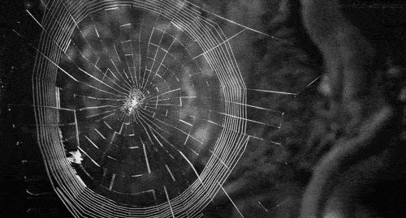

# BADASS



Bu proje de bir veri merkezi ağ altyapısının nasıl tasarlanması gerektiğinin temel pratik uygulamaları GNS3 programı ile simüle edilerek kurgu edilmesi istenmektedir. Aslında daha çok emüle etmek denilebilir. Bu sayede ağ yöneticiliği dünyası hakkında teorik olarak pek çok kavram ve yenilik edinilmiş olacak ve ayrıca pratik olarak da pek çok teknik ve çözümsel yaklaşımlar ile yeni perspektifler edinilmiş olacaktır. Teorik olarak internetin nasıl çalıştığı, özerk sistemlerin (AS) ne olduğu, ağ cihazlarının ne olduğu ve birbirleri ile olan etkileşimleri vb. örnekler verilebilir. Aynı şekilde az önce sıralanan edinimlerin pratik açıdan teknik anlam da arkaplan da nasıl çalıştığı ve nasıl dizayn edilmesi gerektiğinin öğrenilmesi hedeflenmektedir. Ancak ne olursa olsun teknik anlamda veri merkezlerinde oluşan sorunlar bizzat ve doğrudan yaşanılmadıkça bu sorunlar üzerine geliştirilen BGP EVPN, VLAN, VXLAN, VPLS, MPLS vb. teknik yaklaşımlarının tam anlamıyla anlaşılmasının zor olduğu kanaatindeyim. Bu yaklaşımlar ağ mühendisleri tarafından belirli sorunların üstesinden gelinmek amacıyla düşünülmüş ve geliştirilmiş tekniklerdir. Bu yüzden bu projenin bu tekniklerin nasıl kullanılması gerektiğini değil belirli sorunlar yaşanıldığında bu sorunların nasıl üstesinden gelinmesi gerektiğinin edinimini öğretmeyi hedeflemesi gerektiği kanaatindeyim. Bu model daha mühendissel/tekniker bir bakış açısı edinimi sağlayabilirdi. Ancak tabii bunun için bizzat saha da olmak gerekli ve bu mümkün olamadığından belki de bu proje bu kadarını bizlere sunmuştur. Bunların yanı sıra ağ kavramları çok soyut kavramlar olduğundan öğrenildiğini düşünülen şey bir anda farklı bir bağlam da çok farklı biçim de ele alınabilir. Bu da öğrenildiğini düşünülen şey hakkında gerçekten öğrenilip öğrenilmediğine dair şüpheler oluşturabilir. Bunu izah etmek gerekirse; Multicast'i üçgen olarak öğrendiğinizi varsayın (Multicast = üçgen). Ancak Multicast'i farklı bir bağlam da ele aldığınız da aslında Multicast'in kare olduğunu öğreniyorsunuz. Daha sonra yine farklı bir bağlam da ele aldığınızda aslında Multicast yıldızmış. Tüm bunlar fark edildiğinde Multicast'in bağlamsal duruma göre hem teknik hem de ifadesel olarak esnek bir kavram olduğu sonucuna varabilirsiniz. Bu C'de pointer öğrendiğinizi zannetmenize örnek verilebilir :d. Farklı bir kimseden pointer konusunu dinlediğinizde zihninizde ki kavramla örtüşmediğini ancak pointer'ı anlatan kimsenin de çok tutarlı bir şekilde izahat de bulunduğunu fark edip hangisinin doğru olduğunun sorgulamasına düşebilirsiniz. Bu hem siz hem de diğer kimsenin pointer'ı kavramını zihin de nasıl ilişkilendiriğine bağlı bir durumdur. Her iki kişi de zihnin de pointer kavramını tutarlı bir biçim de ilişkilendirmiş ama bunu birbirlerine anlatmaya çalıştıklarında örtüşmediğini fark ederler. Ama günün sonunda aslında aynı şeyden bahsediyorlardır. Özetle belki de tüm bunların sebebi ağ kavramlarının bağlamsal ve anlamsal olarak iç içe geçmesi ve tam anlamıyla bir literatür standardı oluşturulamaması durumu yüzünden her üretici (Cisco, Juniper, FRR vb.) kendi terminolojisini ve isimlendirmesini kullanıyor bu da karmaşıklığın artmasına daha da sebep oluyor.

Bu yazı da tıpkı proje dokümanında olduğu gibi bölüm bölüm ve her bölüm bir öncekinin devamı niteliğinde bir ilerleme yapılacaktır. Her bölüm de karşılaşılan sorunlar dile getirilecek ve bunlara yönelik ne gibi çözümler uygulanabileceği açıklanacaktır. Ayrıca sadece sorun - çözüm odaklı değil proje dokümanın da belirtildiği üzere incelenmesi istenilen kavramların notları da bulunmaktadır. Bu yazının kendisi de internet üzerinde ki herhangi bir kaynaktır ve burada ki açıklamaların mutlak doğru olduğu iddiası yoktur. İlk paragrafta da belirtildiği üzere benim üçgen olarak açıkladığım bir şeyi sizler kare olarak açıklayabilir ve bu çok mantıklı ve tutarlı olabilir. Tıpkı üçgenin bana mantıklı ve tutarlı hissettirmesi gibi. Ama aslında aynı şeyden bahsediyor olabiliriz yani ortada bir şekil olduğu gerçeğinden. 

## İçindekiler
  - ### [Part 1](https://github.com/ayumusakdiken/Bgp-At-Doors-of-Autonomous-Systems-is-Simple/blob/main/P1/README.md)
  - ### [Part 2](https://github.com/ayumusakdiken/Bgp-At-Doors-of-Autonomous-Systems-is-Simple/blob/main/P2/README.md)
  - ### [Part 3](https://github.com/ayumusakdiken/Bgp-At-Doors-of-Autonomous-Systems-is-Simple/blob/main/P3/README.md)
  - ### [Proje Teslimi ve Organizasyonu](#proje-teslimi-ve-organizasyonu)
  - ### [Kaynaklar](#kaynaklar)


## Proje Teslimi ve Organizasyonu
PDF'in proje teslimi hakkında kastettiği şey şu; her cihazın yapılandırmasını ayrı bir dosyaya kaydetmeni istiyor. Her router ve host için elle yazılmış konfigürasyon dosyaları.
Dizin yapısına bakarsak — PDF'te şu dosyalar vardı:

```
P2/
├── P2.gns3project
├── _wil-1_g      ← router-1 config
├── _wil-1_host   ← host-1 config
├── _wil-1_s      ← switch config
├── _wil-2_g      ← router-2 config
└── ...
```

`_g` → router (gateway) config dosyası
`_host` → host config dosyası
`_s` → switch config dosyası

Bu dosyaların içine çalışan topolojinde ki cihazlara uyguladığın her ağ komutunu yazıyorsun — yorum satırlarıyla açıklayarak. Örneğin router-1 config dosyası:

```bash
# Router-1 VXLAN yapılandırması
# VTEP olarak çalışıyor

# VXLAN arayüzü oluştur
ip link add vxlan10 type vxlan id 10 group 239.1.1.1 dstport 4789 dev eth1

# Bridge oluştur
ip link add br0 type bridge
...
```
Bu sayede GNS3 projesi olmasa bile birisi bu dosyalara bakarak topolojiyi yeniden kurabilir.

 `.gns3project` ise topolojinin kendisi yani şemasi ancak içi doldurulmuş olarak değil. Bu GNS3'te `File -> Export Project` olarak `.gns3project` uzantısı şeklinde çıktısı alınabilir. PDF'te ki görsel de çıktı için hangi ayarların seçilmesi gerektiği belirtilmiş.

## Kaynaklar
- [GNS3 kurulumu ve sorunların çözümü](https://www.youtube.com/watch?v=SE--UqXLShg)
- [GNS3 kurulumu ve sorunların çözümü metinli](https://jono-moss.github.io/post/-gns3-install-debian-27-09-2024/)
